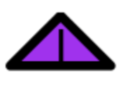
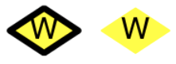

..
  Copyright (C) European XFEL GmbH Schenefeld. All rights reserved.

.. _alarm_system:

************
Alarm System
************

After the removal the ``AlarmService`` device in Karabo 2.19.0,
the alarm system is being reworked.

For now, Karabo provides the following ingredients concerning alarms:

* Each device has an alarm condition property (key "alarmCondition")
  which can be set as any other property via device code.
* The alarm condition property can take the values of the ``AlarmCondition``,
  an Enum in Python and a class with static instances in C++.
* The GUI Alarm Widget for the alarm condition property on scenes with the
  icons mentioned below.
* The GUI Alarm Integer Field and Alarm Float Field widgets that can be
  configured to show yellow or red background if a warn or alarm threshold
  is surpassed.

In Karabo there are four alarm levels, signified by color and symbol.
They are summarized in the following table:

.. table:: Alarm and warning conditions in Karabo and their graphical
           representation

    ================ =================
    Alarm Conditions     Symbol
    ---------------- -----------------
    INTERLOCK        |alarm-interlock|
    CRITICAL         |alarm-critical|
    WARNING          |alarm-warning|
    NONE             None
    ================ =================

A new system to configure and evaluate alarms is currently being developped.
