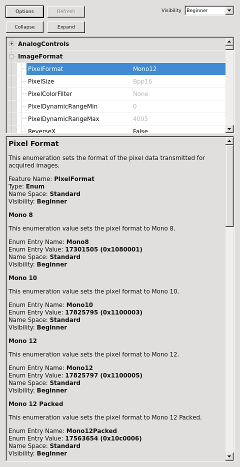

*****************
Camera Interfaces
*****************

Overview
========

.. _genicamCamera:

The genicamCamera package
=========================

Introduction
------------

The genicamCamera package provides a mean for controlling GenICam
compliant cameras [1]_, and is based on the `eBUS SDK
<http://www.pleora.com/our-products/ebus-sdk>`_ from `Pleora
Technologies Inc. <http://www.pleora.com/>`_: this is commercial
software which can be freely used for cameras based on Pleora hardware
(for example: Photonic Science and IMPERX cameras). For all other
GenICam compliant cameras (e.g. Basler cameras) the library will still
be fully functional but will superimpose a watermark on the images. A
licence is then needed in order to get rid of the watermark.

Once you have checked-out and compiled the package (see details in  the next
Section), you will have:

* A plugin (libgenicamCamera.so) providing a very basic interface to
  GenICam cameras. You will just be able to connect to the camera and
  start/stop an acquisition. No camera specific parameters will be
  avaiable.

* A base class (GenicamCamera) in Karabo Framework, from which you can
  derive your camera specific class, where you can add all needed
  parameters.

Installing genicamCamera
------------------------

genicamCamera depends on eBUS, which you will need to install
beforehand. Unfortunately eBUS can only be installed by root user.

You need first to checkout the package by running:

.. code-block:: bash

    ./karabo checkout eBus dependencies branches/4.0

for Ubuntu 12.04 and SL 6.x, or

.. code-block:: bash

    ./karabo checkout eBus dependencies branches/4.1

for Ubuntu 14.04 and SL 7.x.

The package can be then installed within Karabo Framework by running
make

.. code-block:: bash

    cd packages/dependencies/eBus
    sudo env KARABO=`cat $HOME/.karabo/karaboFramework` make

The installer from Pleora will first install eBUS in the
/opt/pleora/ebus_sdk directory, eBUS will then be moved to
$KARABO/extern/lib/ebus_sdk by the Karabo install script. This means
that more then one version of the eBUS SDK can be installed in Karabo
at the same time.

After eBUS have been installed, you can checkout and compile the
genicamCamera package:

.. code-block:: bash

    ./karabo checkout genicamCamera controlDevices branches/0.3-1.4
    cd packages/controlDevices/genicamCamera
    make

How to create a camera device based on genicamCamera
----------------------------------------------------

After installing the genicamCamera package, create your C++ Karabo
Device, called for example myCamera:

.. code-block:: bash

    ./karabo new myCamera controlDevices Device cppDevice minimal MyCamera

Go into the base directory of the project:

.. code-block:: bash

    cd packages/controlDevices/myCamera

Add there a DEPENDS file like this:

.. code-block:: bash

    # type        category       package       tag
    dependency    controlDevices genicamCamera branches/0.3-1.4

Do not forget to add the DEPENDS file to the repository:

.. code-block:: bash

    svn add DEPENDS

The next step you will need, is to update the Netbeans project (see
:ref:`genicamCamera-project` Section).

Once you have done it, you can edit the header and source files (see
:ref:`genicamCamera-hh-file` and :ref:`genicamCamera-cc-file`
Sections).

The first time you compile the project, you will have to do it from
Netbeans (both for the 'Debug' and 'Release' configuration), in order
to have the Makefiles updated.

.. _genicamCamera-project:

Project Properties
++++++++++++++++++

In order to successfully compile the MyCamera device you need instruct
the compiler and the linker to use the eBUS Karabo installation. Once
you open the project in Netbeans, you will have to edit the project
properties (select <All Configurations>).

* Add the line

  .. code-block:: bash

      ${KARABO}/extern/lib/ebus_sdk/4/include

  to the section "C++ Compiler -> Include Directories"

* Add the line

  .. code-block:: bash

      -D_UNIX_ -D_LINUX_

  to the section "C++ Compiler -> Additional Options"

* Add the lines

  .. code-block:: bash

      ${KARABO}/extern/lib/ebus_sdk/4/lib
      ${KARABO}/extern/lib/ebus_sdk/4/lib/genicam/bin/Linux64_x64
      ${KARABO}/extern/lib/ebus_sdk/4/lib/genicam/bin/Linux32_i86

  to the section "Linker -> Additional Library Directories"

* Add the lines

  .. code-block:: bash

      PvStream
      PvBuffer
      PvDevice
      PvBase

  to the section "Linker -> Libraries"

.. _genicamCamera-hh-file:

MyCamera.hh file
++++++++++++++++

The header file MyCamera.hh is very simple and should look like:

.. code-block:: c++

    #ifndef KARABO_MYCAMERA_HH
    #define KARABO_MYCAMERA_HH

    #include <karabo/karabo.hpp>
    #include <karabo/genicam/GenicamCamera.hh>

    /**
     * The main Karabo namespace
     */
    namespace karabo {

        class MyCamera : public karabo::genicam::GenicamCamera {

        public:

            KARABO_CLASSINFO(MyCamera, "MyCamera", "1.4")

            static void expectedParameters(karabo::util::Schema& expected);

            MyCamera(const karabo::util::Hash& config);

            virtual ~MyCamera();

        };

    } // namespace karabo

    #endif // KARABO_MYCAMERA_HH

.. _genicamCamera-cc-file:

MyCamera.cc file
++++++++++++++++

The source file MyCamera.cc can be also fairly simple. The
GenicamCamera will take care of everything, the only part left to you
is the mapping of GenICam features to Karabo expected paramters, which
you have to code in the expectedParameter function:

.. code-block:: bash

    #include "MyCamera.hh"

    using namespace std;
    using namespace karabo::genicam;
    USING_KARABO_NAMESPACES

    namespace karabo {

        KARABO_REGISTER_FOR_CONFIGURATION(BaseDevice, Device<CameraFsm>, GenicamCamera, MyCamera)

        MyCamera::MyCamera(const karabo::util::Hash& config) : GenicamCamera(config) {

        }

        MyCamera::~MyCamera() {

        }

        void MyCamera::expectedParameters(Schema& expected) {
            // Fill here with the list of expected parameters
        }

    } // namespace karabo

How to read/write parameters from/to the camera
+++++++++++++++++++++++++++++++++++++++++++++++

Each parameter on the camera you want to have available in the
Karabo device, must have a corresponding expected parameter in the
Karabo device. The expected parameter must be tagged as 'genicam'. Please
have a look at the :ref:`genicam-expected-parameters` Section for the
details.

.. _genicam-expected-parameters:

Expected parameters
-------------------

For the camera parameters you want to have in the Karabo device,
you will need to find out the GenICam 'Feature Name' and 'Type'. One
way of doing it is with the help of the eBUSPlayer, which you will find
installed in $KARABO/extern/lib/ebus_sdk/4/bin.

Once you are connected to the camera, if you click on the "Device
control" button you will get a list of all available features. By
clicking on one, for example 'PixelFormat', you will be able to
inspect its details, as shown in :ref:`Figure 1 <genicam-pixelFormat>`.

.. _genicam-pixelFormat:

   **Figure 1.** Description of the 'PixelFormat' as given by eBUSPlayer.

With this information you will be able now to create the corresponding
entry in the expectedParameters function:

.. code-block:: c++

    STRING_ELEMENT(expected).key("pixelFormat")
        .alias("PixelFormat")  // The GenICam 'Feature Name'
        .tags("genicam enum poll")
        .displayedName("Pixel Format")
        .description("This enumeration sets the format of the pixel data "
                     "transmitted for acquired images.")
        .assignmentOptional().noDefaultValue()
        .options("Mono8 Mono10 Mono12")
        .reconfigurable()
        .allowedStates("Ok.Ready")
        .commit();

The correspondence between GenICam and Karabo types is given in the
:ref:`genicam-data-types` Section.

As already mentioned, all GenICam parameter must have the 'genicam'
tag. The description of the other available tags can be found in the
:ref:`genicam-tags` Section.

.. _genicam-tags:

Tags
++++

* **'genicam'** tag: Parameters to be read from (written to) the
  GenICam camera must have the 'genicam' tag.

* **'readOnConnect'** tag: Parameters having the 'readOnConnect' flag
  will be read from the camera when the Karabo device connects to
  it.

* **'enum'** tag: to be used for the GenICam 'Enum' type, to
  distinguish it from the 'String' type (since both of them are mapped
  to STRING_ELEMENT Karabo type).

* **'poll'** tag: Parameters having the 'poll' tag will be polled
  periodically. The poll interval is a parameter of the base class.

.. _genicam-data-types:

Data types
++++++++++

This is the correspondence between GenICam and Karabo data types:

+-----------------+-----------------+
| GenICam Type    | Karabo Type     |
+=================+=================+
| Boolean         | BOOL            |
+-----------------+-----------------+
| Integer         | INT32           |
+-----------------+-----------------+
| Float           | DOUBLE          |
+-----------------+-----------------+
| String          | STRING          |
+-----------------+-----------------+
| Enum            | STRING          |
|                 | (+ 'enum' tag)  |
+-----------------+-----------------+

Starting the device
-------------------

Before you can start the C++ device server, you need to set-up the
environment for eBUS. This is done by sourcing the set_puregev_env
bash script.

If you use the allStart script to start your devices, it is sufficient
that you add the line

.. code-block:: bash

    source $KARABO/extern/lib/ebus_sdk/4/bin/set_puregev_env

to the allInfo script, at the beginning of the C++ Device Server
section.

.. rubric:: Footnotes

.. [1] GenICam is the abbreviation for "Generic Interface for Cameras"
   and is a generic programming interface for machine vision
   (industrial) cameras (see e.g. `wikipedia
   <https://en.wikipedia.org/wiki/GenICam>`_).

.. _limaDevice:

The limaDevice package
======================

Introduction
------------

The limaDevice package provides a mean for controlling cameras supported by
LImA [1]_, for example Basler cameras.

Installing limaDevice
---------------------

limaDevice depends on lima package, which you will need to install
beforehand. lima is currenly configured to support the Simulator and
the Basler plugins, therefore pylon is needed when you compile it.

The first step is to checkout and install pylon:

.. code-block:: bash

    ./karabo checkout pylon dependencies tags/2.3.3b02
    cd packages/dependencies/pylon
    make

Then you can checkout, compile and install lima:

.. code-block:: bash

     ./karabo checkout lima dependencies tags/20151112
     cd packages/dependencies/lima
     make

Finally you can checkout and install limaDevice:

.. code-block:: bash

    ./karabo checkout limaDevice dependencies tags/2.0.0-1.3
    cd packages/dependencies/limaDevice
    make

How to create a camera device based on limaDevice
-------------------------------------------------

After installing the dependencies (pylon, lima, limaDevice) as
described above, create your Python Karabo Device, called for example
myLimaCamera:

.. code-block:: bash

    ./karabo new myLimaCamera controlDevices pythonDevice minimal MyLimaCamera

Go into the base directory of the project:

.. code-block:: bash

    cd packages/controlDevices/myLimaCamera

Add there a DEPENDS file like this:

.. code-block:: bash

    # type       category     package      tag
    dependency   dependencies pylon        tags/2.3.3b02
    dependency   dependencies lima         tags/20151112
    dependency   dependencies limaDevice   tags/2.0.0-1.3

Do not forget to add the DEPENDS file to the repository:

.. code-block:: bash

    svn add DEPENDS

Once you have done it, you can edit the source file (see
:ref:`limaDevice-py-file` Section).

.. _limaDevice-parameters:

LimaDevice expected parameters
++++++++++++++++++++++++++++++

Some LImA parameters are already available in the LimaDevice base class:

* Camera Type
* Camera Model
* Sensor Width [pixel]
* Sensor Height [pixel]
* Image Depth [bytes]
* Trigger Mode
* Exposure Time [ms]
* Latency Time [ms]
* Number of Frames
* Image Rotation [degrees]
* Image Flip (X and Y)
* Image Binning (X and Y)
* ROI (X, Y, Width and Height)

.. _limaDevice-py-file:

MyLimaCamera.py file
++++++++++++++++++++

Two methods are abstract in LimaDevice and must therefore be defined
in MyLimaCamera:

.. function:: initializeCamera

    is the function where the Camera and HwInterface objects have to be
    initialized.

.. function:: triggerModeOptions

    must return the options available for the
    trigger mode. They are for example "IntTrig" for Simulator,
    "IntTrig ExtTrigSingle ExtGate" for Basler plugin.

There are also two user's hooks in the LimaDevice class, which do
nothing by default but can be overwritten in the derived class:

.. function:: pollCameraSpecific

    is called regularly, and can be used to read
    parameters from the camera and set them in the MyLimaCamera device.

.. function:: reconfigureCameraSpecific

    is called upon reconfiguration of the
    device, and can be used to set camera specific parameters.

This is for example the code for a camera using the Simulator
plugin (Lima.Simulator subpackage):

.. code-block:: python

    #!/usr/bin/env python

    __author__="john.smith@xfel.eu"
    __date__ ="Apr 12, 2016,  1:38 PM"
    __copyright__="Copyright (c) 2010-2016 European XFEL GmbH Hamburg. All rights reserved."

    from karabo.camera_fsm import CameraFsm
    from karabo.decorators import KARABO_CLASSINFO
    from karabo.device import PythonDevice, launchPythonDevice

    from lima_device.lima_device import LimaDevice

    import Lima.Simulator

    @KARABO_CLASSINFO("MyLimaCamera", "1.4")
    class MyLimaCamera(LimaDevice, PythonDevice, CameraFsm):

	def __init__(self, configuration):
	    # always call PythonDevice constructor first!
	    super(MyLimaCamera,self).__init__(configuration)

	@staticmethod
	def expectedParameters(expected):
	    # Simulated camera does not have any additional parameters
	    pass

	def initializeCamera(self):
	    self.log.INFO("Initialize Simulated camera")

	    # Creates the camera object (Simulator)
	    self.camera = Lima.Simulator.Camera()
	    # Creates the HwInterface
	    self.interface = Lima.Simulator.Interface(self.camera)

	def triggerModeOptions(self):
	    return "IntTrig"

    # This entry used by device server
    if __name__ == "__main__":
	launchPythonDevice()

.. rubric:: Footnotes

.. [1] `Lima <http://lima.blissgarden.org/>`_ ( **L**\ibrary for
   **Im**\age **A**\cquisition) is a project for the unified control
   of 2D detectors.

Data Format
===========

Image Processing Algorithms
===========================

.. _imageProcessing:

Introduction
------------

The imageProcessing package provides two python submodules,
image_processing.image_processing and
image_processing.image_running_mean.

In image_processing.image_processing a number of functions is
provided, which can be used to do some basic processing on a
numpy.ndarray.

In image_processing.image_running_mean the ImageRunningMean class is
provided, which can be used to calculate a simple moving average or
a cumulative moving average (please find `here
<https://en.wikipedia.org/wiki/Moving_average>`_ the definition) of a
numpy.ndarray.

The image_processing submodule
------------------------------

The functions in image_processing submodule can be imported with::

    from image_processing.image_processing import *

Many of the functions will by default modify the input image: to
avoid that use the copy=False option.

The following functions are available:

.. function:: imagePixelValueFrequencies(image)

    Call internally numpy.bincount, and return the one dimensional
    ndarray of pixel value frequencies. Input image must have integer
    dtype.

.. function:: imageSetThreshold(image, threshold, copy=False)

     Pixels below threshold are set to zero.

.. function:: imageSubtractBackground(image, background, copy=False)

    Background is subtracted from image. Beware the image data type:
    It should be signed since subtraction can result in negative
    values!

.. function:: imageApplyMask(image, mask, copy=False)

    mask is applied to the image. Mask values below 0 masks out
    pixels.

.. function:: imageSelectRegion(image, x1, x2, y1, y2, copy=False)

    Everything outside the rectangular region is set to zero.

.. function:: imageSumAlongY(image)

    Image is summed along the Y axis.

.. function:: imageSumAlongX(image)

    Image is summed along the X axis.

.. function:: imageCentreOfMass(image)

    Return centre-of-mass and width of an image (1-D or 2-D). If the
    image is 1-D it returns (x0, sx); if the image is 2-D it returns
    (x0, y0, sx, sy). For the calculations numpy.average and
    numpy.sqrt are used.

.. function:: fitGauss(image, p0=None, enablePolynomial=False)

    Return the gaussian fit parameters of an image (1-D or
    2-D). Additionally a first order polynomial a*x + b*y + c can be
    added to the gaussian. Returned values are (A, x0, sx, covariance,
    error) or (A, x0, sx, a, c, covariance, error) in case of 1-D, (A,
    x0, y0, sx, sy, covariance, error) or (A, x0, y0, sx, sy, a, b, c,
    covariance, error) in case of 2-D.  The fit is done with the help
    of the scipy.optimize.leastsq function, with full_output option.

.. function:: fitGauss2DRot(image, p0=None, enablePolynomial=False)

    Return the gaussian fit parameters of a 2-D image, including
    rotation. Additionally a first order polynomial a*x + b*y + c can
    be added to the gaussian. Returned values are (A, x0, y0, sx, sy,
    theta, covariance, error) or (A, x0, y0, sx, sy, theta, a, b, c,
    covariance, error). The fit is done with the help of the
    scipy.optimize.leastsq function, with full_output option.

The ImageRunningMean class
--------------------------

This image_processing.image_running_mean submodule provide the
ImageRunningMean class::

    from image_processing.image_running_mean import ImageRunningMean

The available methods for the class are:

.. function:: append(image, maxlen=None)

    Append an image to the queue and update the running mean. By
    default the cumulative moving average is calculated, if you want
    the simple moving average you have to use the parameter maxlen to
    pop the excess images. The method will raise a ValueError if the
    image has not the same shape as the other ones in the queue.

.. function:: popleft()

    Pop an image from the queue, and update the running mean.

.. function:: clear()

    Clear the queue and reset the running mean.

.. function:: recalculate()

    Recalculate the mean.

.. function:: runningMean()

    Return the running mean.

.. function:: size()

    Return the size of the queue.

.. function:: shape()

    Return the shape of images in the queue.

Online Visualization Options
============================