**************
The Karabo GUI
**************

Getting Started
===============

The GUI starts up into a non-connected state, meaning that you need to login
to a specific GUI server with your login credentials. By doing so your access
level is also determined and the appropriate options will be available to you.

.. code-block:: bash

    karabo-gui

will open up this panel:

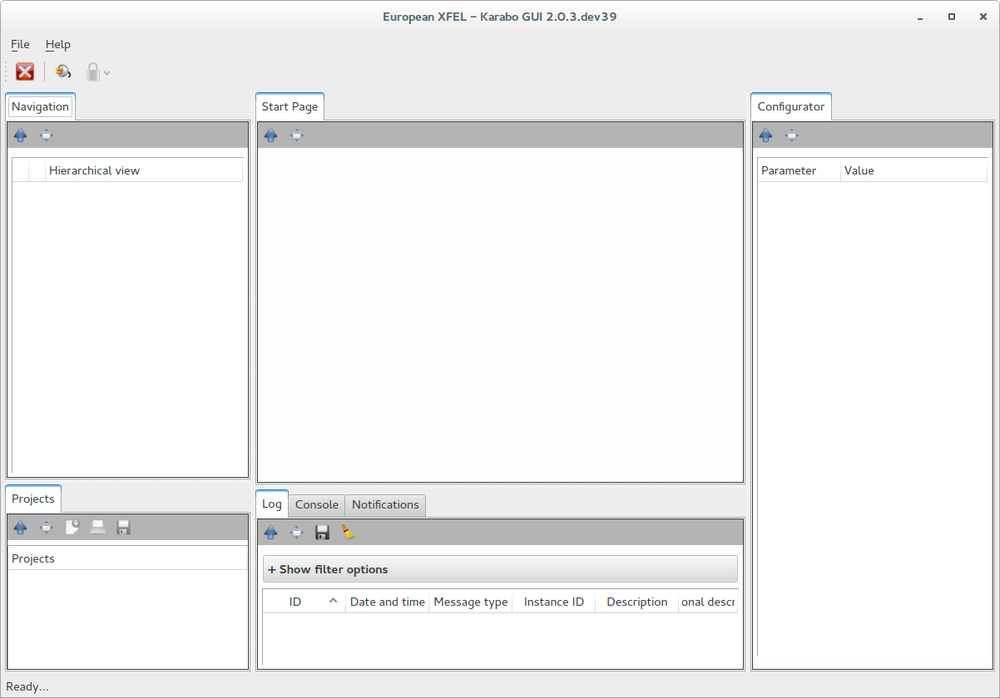

   The GUI view upon GUI startup

You can see that most of the panels are still empty, as you are in a
non-connected state. The panels are in clock-wise, starting at the center-top
(12 o'clock) position

* The central scene, which is used to display custom views
* The configurator panel, which lists *all* properties and slots available for
    a device as appropriate for your access level
* The logging panel, giving access to global logging, the alarm service
    and an an iKarabo console
* The project panel, giving you a logical view on the projects you have loaded
* The navigation panel, which gives you a live view of the full system topology
and allows for filtering.

In order to connect yourself to a ``GUI server``, click on the connect icon. The
following dialoag will appear, asking you for your credentials and the gui
server with port you would like to connect to.
The ``GUI server`` combo-box will remember the last used gui servers up to a maximum of 5.

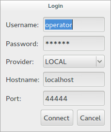

   The GUI connection dialog.

Upon connection the GUI will switch to a connected state, which already shows
you a live view of the system.

Any of the listed panels may be detached and arranged separatly on the screen.
In the following we will discuss each panel in more detail, followed by a discussion of best-
practices when creating custom panels for distributed control systems.

The Navigation Panel
====================

The navigation panel gives you a live view of the system, in a tree hierarchy.
This is in contrast to the project panel, which presents a logical view of
the system, as grouped by components.

In its default view, the navigation panel shows the system topology in tree
hierarchy showing the unified and alarm states of the running devices.

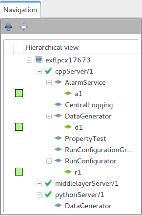

   The Karabo navigation panel. Icons next to the device instance id give you
   the **color code status** of the device, as well as the alarm condition of the device
   if an alarm is active.

The Project Panel
=================

The project panel is the main access point for interacting with projects and
devices in a hierarchical fashion.

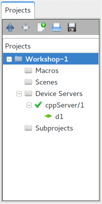

   The Karabo project panel.

It allows you to open an existing project, which is then included on the top-
hierarchy level, or to add members into existing projects.

A project has different categories namely:

- Macros
- Scenes
- Device Servers
- Subprojects

The context menu allows to either add or load project members to a project.

Adding a sub project or loading a project from the repository is done through a
dialog, which allows to browse for existing configurations.

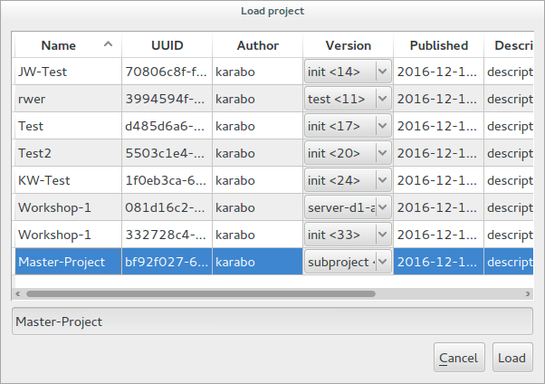

   The project load dialog.

Configuring Servers
+++++++++++++++++++

Servers are configured using a dialog which is either accessible from the
server's context menue or opens when a new server is added as a member.
The dialog also (optionally) configures the host, which is useful if servers
are deployed through Karabo. Instances are added to the server either through
the context menue or by dragging them onto the server from the live view.

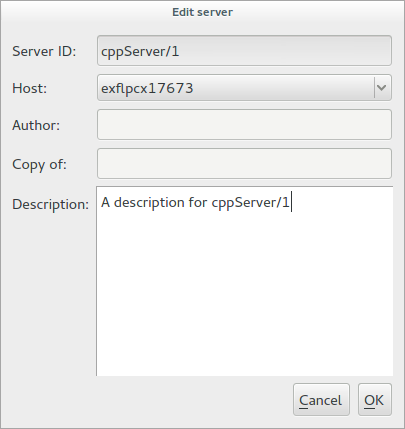

   The server config dialog.

Configuring Instances
+++++++++++++++++++++

Instances are configured using the corresponding dialog, or through the context
menu, which allows direct selection and creation of configurations.

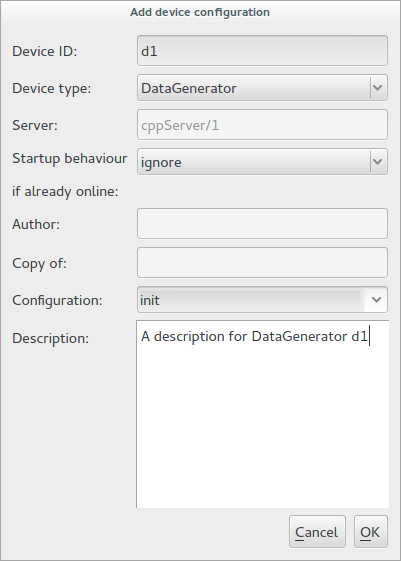

   The instance config dialog.

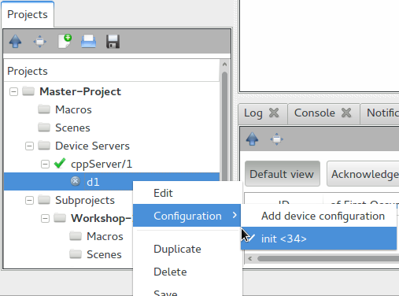

   The instance context menu.

.. note::

    For configuring new Beckhoff servers it is best practice to instantiate
    the server somewhere in the domain of the project, i.e. manually on the
    host and let the server create generic devices. This will yield the proper
    instance ids on each device, as configured on the PLC. You should then
    drag the server into your project and then reassing a specialized class
    for each device instance.

The Alarm Service
+++++++++++++++++

Alarms can be viewed and acknowledged through the alarm service. The panel is located in
the middle area of the GUI. It uses the following custom widget.

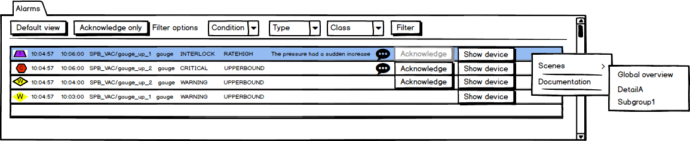

   The alarm service widget.

The Logging Panel
+++++++++++++++++

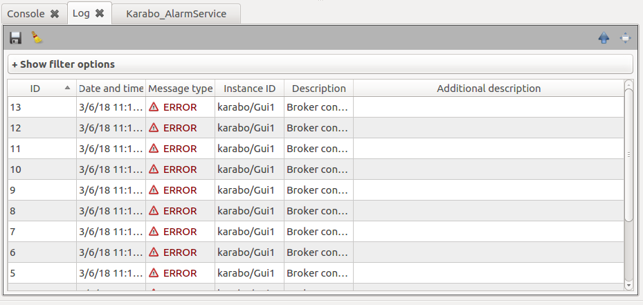

The Central Scene
=================

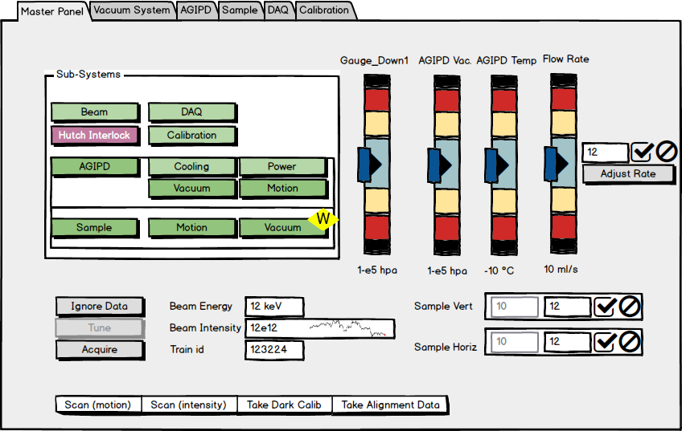

   An example of a master panel in a central scene. Examples of analogue
   gauges for value display, spark lines indicating trends, and state + alarm
   conditions composite values are shown. The Sub-system boxes link to the
   respective detailed scense. Note how with one look onto the gauge widgets
   an operator can access the system state.

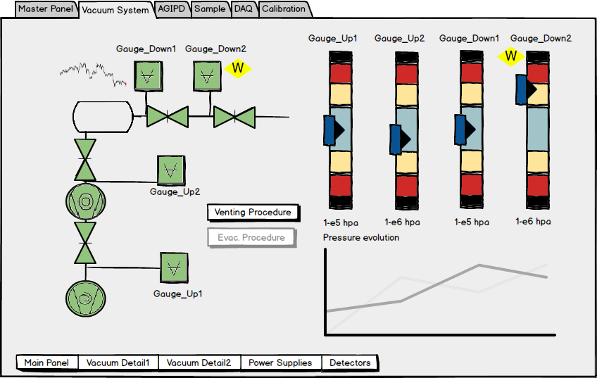

   An example of a detail panel in a central scene. Examples of analogue
   gauges for value display, spark lines indicating trends, and state + alarm
   conditions composite values are shown. Note how the state and alarm condition
   are separated for the gauge **Gauge_Down2**. The bottom buttons are hyper-links
   to the other detail panels and the master panel.

Scene Composition - Basic Widgets
+++++++++++++++++++++++++++++++++

Evaluate Expression
~~~~~~~~~~~~~~~~~~~

The user can enter an expression which will be evaluated by the widget.

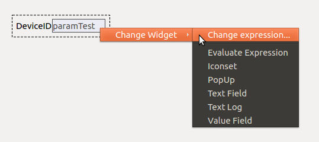

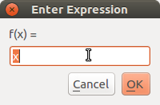

Iconset
~~~~~~~

This type of widget will just show a icon in the scene.

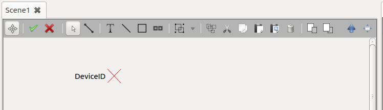

It's possible to add an icon image using an url or from a file.

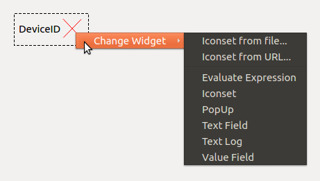

PopUp
~~~~~

If the widget is configured as a **PopUp**, the value of the property will be shown
in a pop-up dialog whenever changes occur.

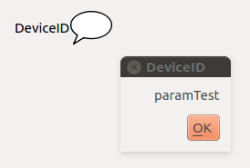

Text Field
~~~~~~~~~~

Just a normal box which the user could enter or see information of the property.

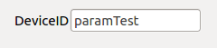

Text Log
~~~~~~~~

This widget gives to the user the history regarding the value of the property.

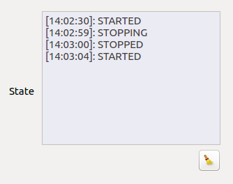

The user can also clear the log of the widget using the button above the box.

Value Field
~~~~~~~~~~~

This widget just shows to the user the value of the property in a box.

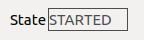

Combo Box
~~~~~~~~~

A combobox widget with the values of the property which were defined previously.

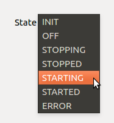

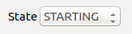

Generic Lamp
~~~~~~~~~~~~

This is just widget which signalize using colors what is property value.

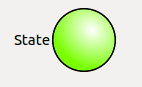

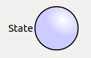

State color field
~~~~~~~~~~~~~~~~~

This widget is the same as described in Generic Lamp, the difference is just
the shape of the object which will show to the user the state color of the
property.

.. figure:: images/gui/state_color_field.png
   :alt: state_color_field.png

Single Bit
~~~~~~~~~~

A widget which change his color according to the property value.

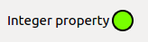

The Table Element
~~~~~~~~~~~~~~~~~

Using the table element widget the user can see and edit some properties of the
device. The name and the values of each properties are showed in each column of
the widget.

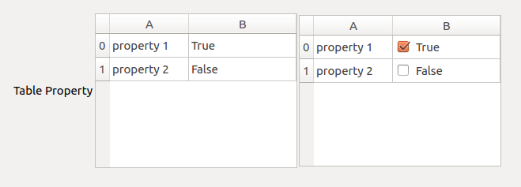

Analog Widget
~~~~~~~~~~~~~

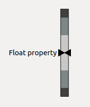

List
~~~~

This widget just shows to the user a box with the whole values of the property.

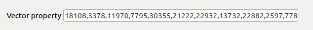

Switch Bool
~~~~~~~~~~~

This widget shows to the user the state of the bool property and also is
possible to invert the logic of the colors.

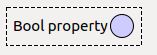

Toggle Field
~~~~~~~~~~~~

This widget is similar to the 'Switch Bool'. However, the boolean property is
showed as a different icon.

.. figure:: images/gui/toggle_field.png
   :alt: toggle_field.png

Progress Bar
~~~~~~~~~~~~

The Progress Bar widget shows to the user the percentage value of the property
taking in consideration the max and min values of the property.

.. figure:: images/gui/toggle_field.png
   :alt: toggle_field.png

File in
~~~~~~~

With this widget it's possible to the user to select a file and the path to the
file will be showed in the box.

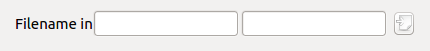

Plotting Widgets
++++++++++++++++

Trendlines
~~~~~~~~~~

Trendlines show the evolution of a value over time. Multiple values may
be grouped into one trendline plot. Quick access buttons exist to scale
the trendline to the display the last 10 minutes, one hour, one day and one week
of data logs. The trendline may be set to either display the full range of values,
or as usually more useful, a detail range, selectable by relative deviation from
the mean of the last 10 values. Optionally, the alarm ranges are indicated
in the trendline.

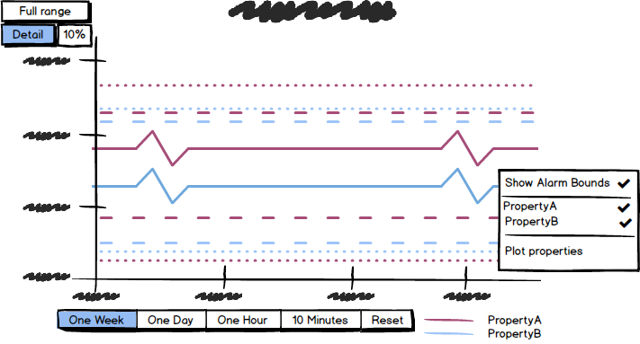

.. note::

   You may miss the red, orange and yellow tones from the color selection options
   for data series lines. This is on purpose, as in Karabo these colors are
   reserved for alarm condition indication, and should not be used for other
   purposes!

Plotting X vs. Y Values
~~~~~~~~~~~~~~~~~~~~~~~

The XY-Plot show the relationship between two variables. To create that plot
the user has to add a property into the scene and select the XY-Plot by right
clicking the property.

.. figure:: images/gui/adding_property.png
   :alt: adding_property.png

After that, it's possible to add others properties into the plot just dragging
and drop that to the graph. It's also possible to click on the plot to see
which points were used.

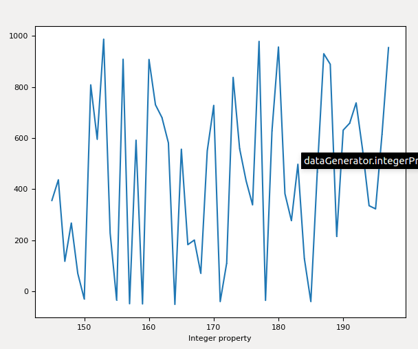

Multi-Curve Plot
~~~~~~~~~~~~~~~~

This graph is similar to the 'Plotting X vs. Y Values' but the user can also
add more properties into it.

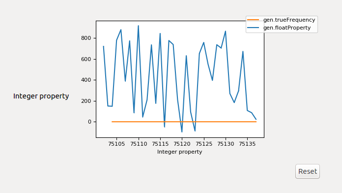

Plot
~~~~

It's also possible to plot the list of the properties values.

.. figure:: images/gui/list_plot.png
   :alt: list_plot.png

Sparkline
~~~~~~~~~

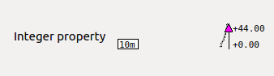

Image Widgets
+++++++++++++

Image Element
~~~~~~~~~~~~~

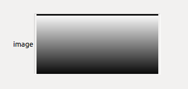

Image View
~~~~~~~~~~

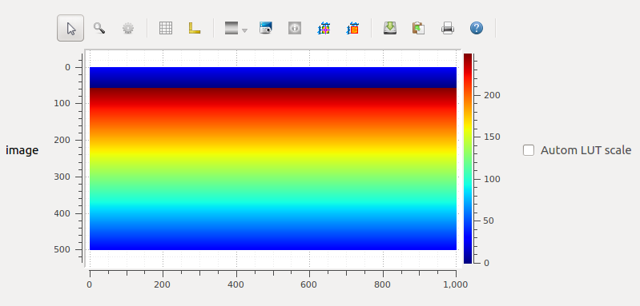

Scientific Image
~~~~~~~~~~~~~~~~

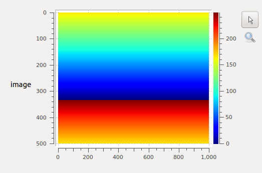

Webcam Image
~~~~~~~~~~~~

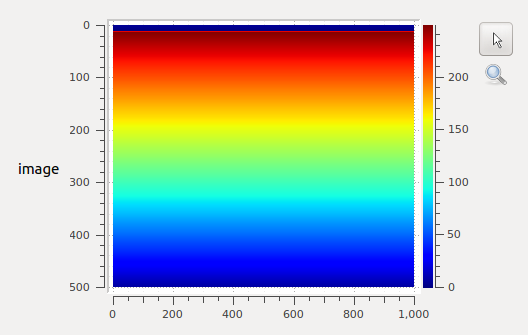

The scene toolbar
=================

Scenelink - Hyperlinks between Scenes
+++++++++++++++++++++++++++++++++++++

It's possible to link between scenes using the scene link widget. For this,
please go to edit mode of the scene and select the tool *Add scene link to scene*
from the toolbar. Afterwards, click on the scene and a dialog will pop up for configuration.

Scenelink - Hyperlink widget:

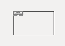

In this configuration window the target can be selected as well as the link
widget should open the scene in the **Main Window**, or in a new pop-up **Dialog**.

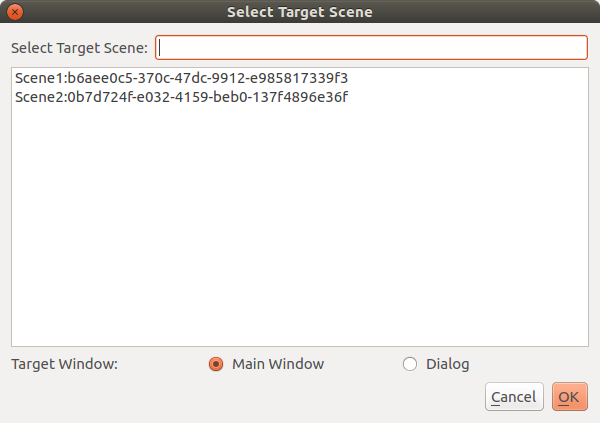

