**************
The Karabo GUI
**************

Getting Started
===============

The GUI starts up into a non-connected state, meaning that you need to login
to a specific GUI server with your login credentials. By doing so your access
level is also determined and the appropriate options will be available to you.

.. code-block:: bash

    ./start-gui

will open up this panel:

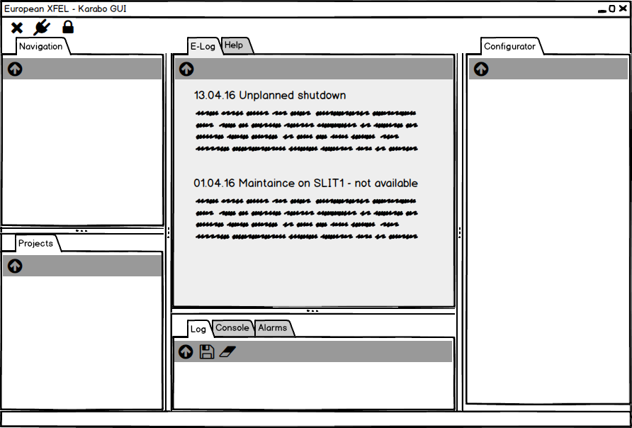

   The GUI view upon GUI startup

You can see that most of the panels are still empty, as you are in a
non-connected state. The panels are in clock-wise, starting at the center-top
(12 o'clock) position

* The central scene, which is used to display custom views
* The configurator panel, which lists *all* properties and slots available for
    a device as appropriate for your access level
* The logging pannel, giving access to global logging messages, alarms and
    an iKarabo console
* The projcets panel, giving you a logical view on the projects you have loaded
* The navigation panel, which gives you a live view of the system in a flat
    hierarchy and allows for filtering.

As indicated in the Figure the central scene shows a browser window of an
ELOG electronic notebook, pertinent to the last gui-server this gui-client
was connected to. In this way you immediately get an overview of the last events
relevant for the instrument you are at.

You may also switch over to the ``Help`` tab, which gives a quick overview of
the function of every panel and links you to this documentation.

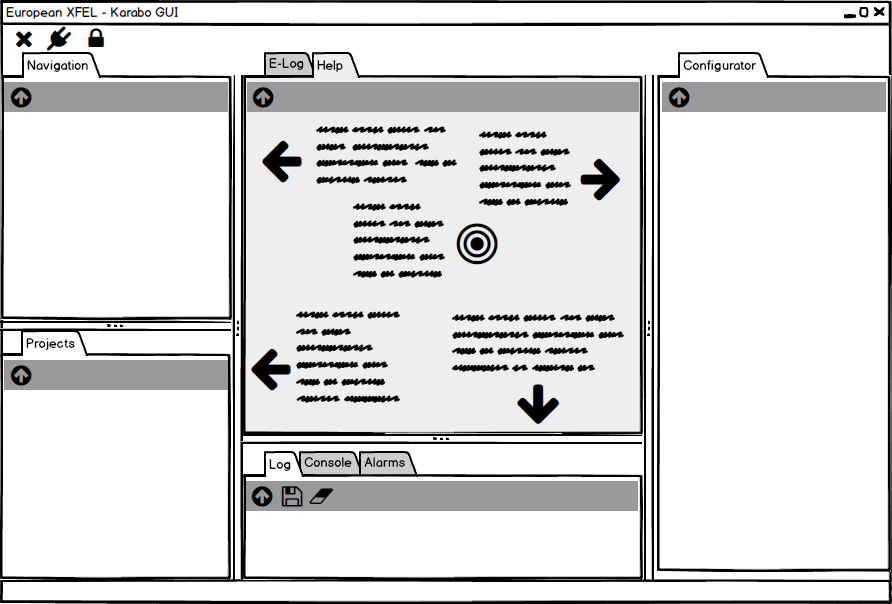

   The GUI view upon GUI startup - Help Tab

In order to connect yourself to a domain, click on the connect icon. The
following dialoag will appear, asking you for your credentials and the domain
you would like to connect to. The ``GUI server`` combo-box will update itself
to the list of GUI-servers available for this domain. Further you can choose
if the GUI should open the last view you had configured for this client.

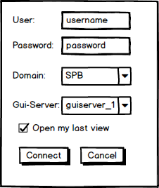

   The GUI connection dialog.

.. todo::

    Discuss if we allow domain selection on login. It could be resolved via
    the central database. KW, DG, MM

    I think the last view option would be potentially nice to have but it should
    be discussed if the information is centralized, or per client or an option
    for both.

Upon connection the GUI will switch to a connected state, which already shows
you a live view of the system. It will also open up the last view you had
configured if you checked this option.

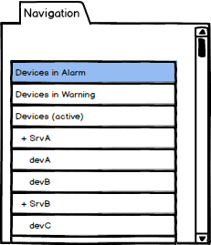

   The GUI in its connected state.

Any of the listed panels may be detached and arranged separatly on the screen.
This arrangement is saved as part of your last connected view. In the following
we will discuss each panel in more detail, followed by a discussion of best-
practices when creating custom panels for distributed control systems.

The Navigation Panel
====================

The navigation panel give you a live view of the system, in a flat hierarchy.
This is in contrast to the project panel, which presents a logical view of
the system, as grouped by components. In the navigation panel, in contrast,
the only hierarchical grouping is device instances grouped by the device
servers they belong too.

In its default view, the project panel shows four groups of devices, on the
top, those in a critical alarm state, i.e. those which have either triggered
and interlock due to their state or those which have properties in a critical
state.

The second panel groups all devices in a warning state on their properties. The
third panel shows all other devices which are currently instantiated. Finally,
the fourth group shows all inactive instances in the topic.

.. figure:: images/gui/navigation_panel.png
   :alt: navigation_panel.png

   The Karabo navigation panel. The context menu highlight how you
   can directly access all scenes a device participates in as well as its
   documentation. Icons next to the instance id give you the color code state
   of the device, as well as the alarm condition the device is in. Finally,
   the large lock indicated that a device is locked due to ``Topic locking``,
   the smaller, framed lock that it is locked due to ``Device Locking``.

The navigation panel may be switched to different filter views, which change
the groups. In either case, within a group, devices in an alarm state will
be shown at the top of the group, devices in a warning state follow next, then
active devices and finally non-instantiated devices. The filter options are as
follows:

    - group by device class
    - group by tag
    - group by server type

.. todo::

    Discuss additional filtering options: KW, DG, MM

The Project Panel
=================

The project panel is the main access point for interacting with projects and
devices in a hierarchical fashion.

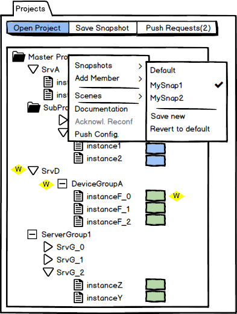

   The Karabo project panel. The context menue shows the options
   available for project members. Here the snapshot selection is
   visible. Some options, such as ``Acknowledging Reconfiguration``
   may only be enabled for higher access-levels.

It allows you to open an existing project, which is then included on the top-
hierarchy level, or to add members into existing projects, as seen below.

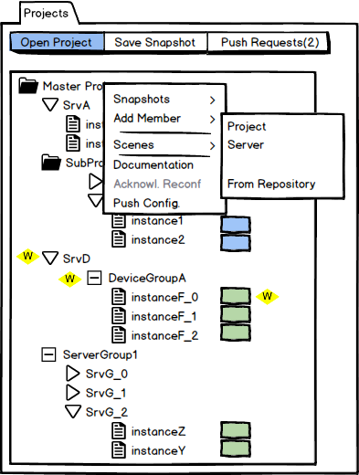

   The Karabo project panel. The context menue shows the options
   available for adding project members.  Servers, server groups or
   subprojects, either empty or from the repository may be added
   to a project member.

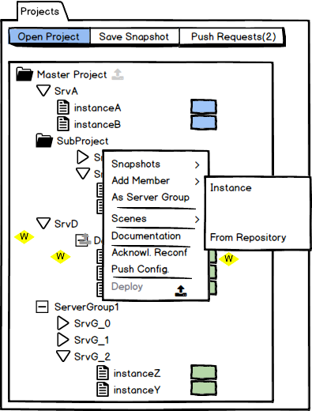

   The Karabo project panel. The context menue shows the options
   available for adding project members. Device instances and device
   groups, either empty or from the repository may be added
   to a project member.

Adding a members from the repository and opening a project is done through a
similar dialog, which allows to browse for existing configurations. In this
dialog wildcards to the database structure are allowed.

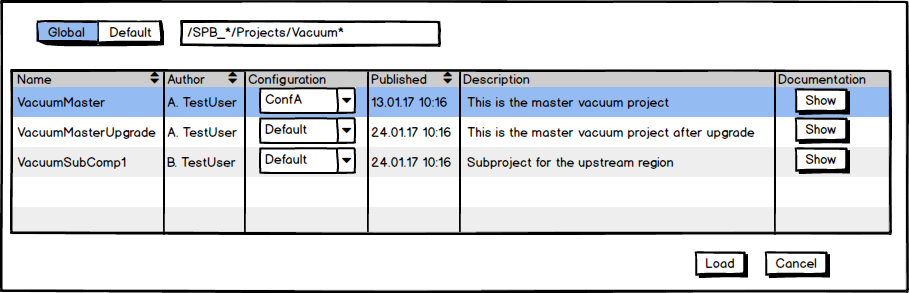

   The project open dialog.

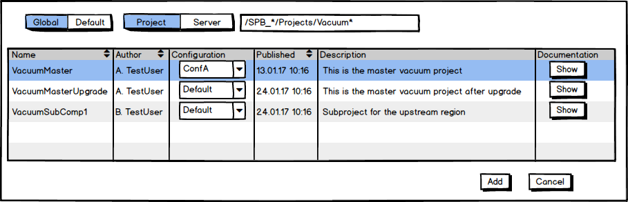

   The add project member dialog.

Incoming reconfigurations may be acknowledged directly on the member and are
indicated by symbols along the hierarcy (grayed-out for upper hierarchy items).
A new reconfiguration can be pushed from the corresponding dialog by configuring
the properties to be reconfigured.

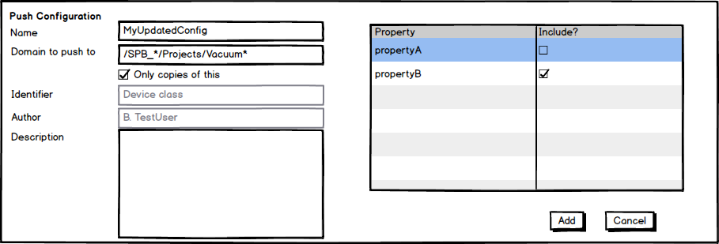

   Pushing a new configuration. Here it has been selected to only push to
   actual copies of this configuration (and copies thereof).

Configuring Servers
+++++++++++++++++++

Servers are configured using a dialog which is either accessible from thes
server's context menue or opens when a new server is added as a member.
The dialog also (optionally) configures the host, which is useful if servers
are deployed through Karabo. Instances are added to the server either through
the context menue or by dragging them onto the server from the live view.

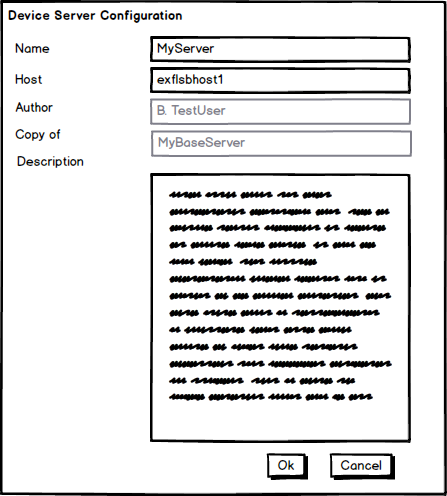

   The server config dialog.

Configuring Instances
+++++++++++++++++++++

Instances are configured using the corresponding dialog, or through the context
menu, which allows direct selection and creation of configuraitons.

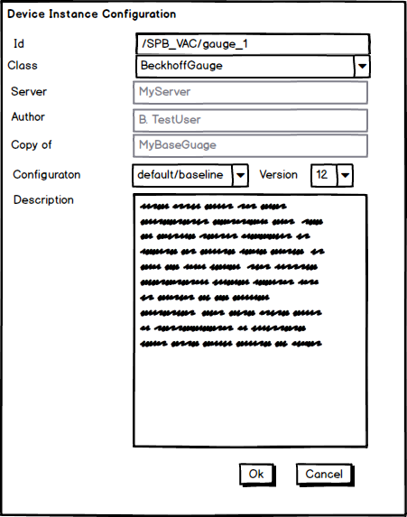

   The instance config dialog.

.. figure:: images/gui/project_panel_instance.png
   :alt: project_panel_instance.png

   The instance context menu.

.. note::

    For configuring new Beckhoff servers it is best practive to instantiate
    the server somewhere in the domain of the project, i.e. manually on the
    host and let the server create generic devices. This will yield the proper
    instance ids on each device, as configured on the PLC. You should then
    drag the server into your project and then reassing a specialized class
    for each device instance.

Configuring Device and Server Groups
++++++++++++++++++++++++++++++++++++

Device and server groups are configured from a dialog, available in the context
menue of an existing instance which will serve as template. It allows to select
properties which are then filled either using a python expression, where ``i``
is the instance number, from a list, or as a constant. All other properties are
left as configured for the template instance.

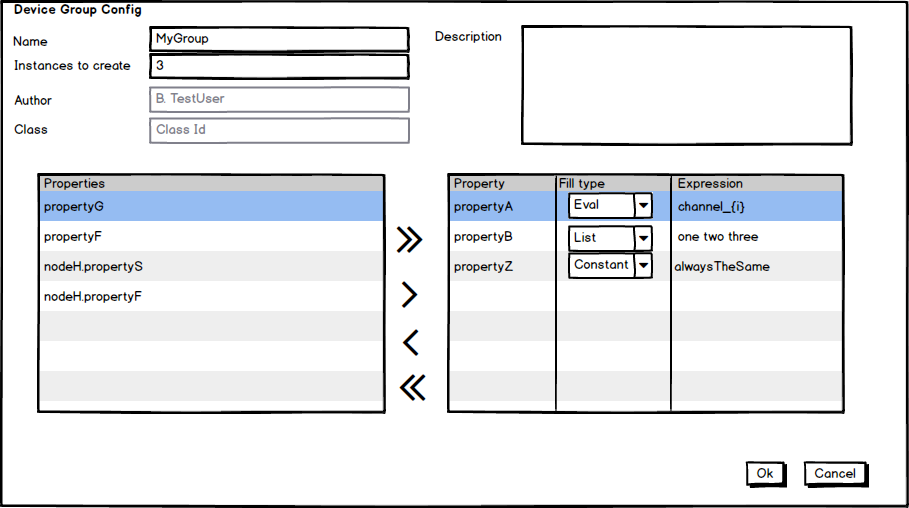

   The group configuration dialog, which is similar for server and device
   instance groups.

The Configuration Panel
=======================

The configuration panel is the generic instance configuration interface of
Karabo. It should be used for base configuration of instance. In contrast,
every-day monitoring and adjusting should be done from central scene panels.

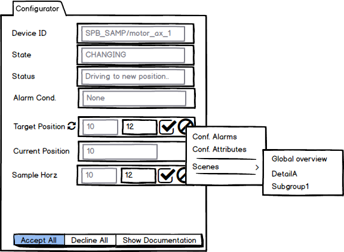

   The configuration panel. Alarm and attribute configuration for each
   property are available from the property's context menu. In this example
   alteration of the ``targetValue`` property will directly influence the
   hardware without requiring a command being issued. This is indicated by the
   small icon.

.. _configuring_alarms:

Configuring Alarms and Attributes
+++++++++++++++++++++++++++++++++

Each property in the configuration panel has a context menu allowing to
specify automatically evaluated alarms as well as some attributes such as
unit an metric prefix.

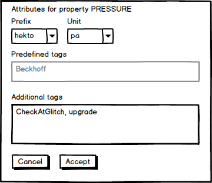

   The attribute configuration panel.

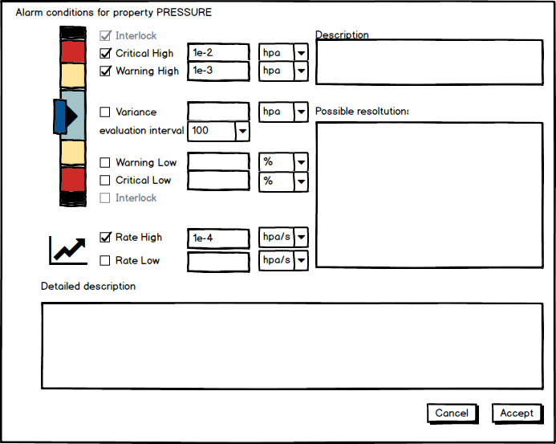

   The alarm configuration panel. Note how the configuration already indicated
   how the alarm ranges will be shown in the analague guage widget.

The Alarm Service
+++++++++++++++++

Alarms are acknowledged through the alarm service. It uses the following
custom widget.

.. figure:: images/gui/alarm_service.png
   :alt: alarm_service.png

   The alarm service widget.

The Central Scene
=================

.. figure:: images/gui/master_panel.png
   :alt: master_panel.png

   An example of a master panel in a central scene. Examples of analogue
   guages for value display, spark lines indicating trends, and state + alarm
   conditions composite values are shown. The Sub-system boxes link to the
   respective detailed scense. Note how with one look onto the gauge widgets
   an operator can access the system state.

.. figure:: images/gui/detail_panel.png
   :alt: detail_panel.png

   An example of a detail panel in a central scene. Examples of analogue
   guages for value display, spark lines indicating trends, and state + alarm
   conditions composite values are shown. Note how the state and alarm condition
   are separated for the gauge **Gauge_Down2**. The bottom buttons are hyper-links
   to the other detail panels and the master panel.

Scene Composition
+++++++++++++++++

Plotting Widgets
++++++++++++++++

Trendlines
~~~~~~~~~~

Trendlines show the evolution of a value over time. Multiple values may
be grouped into one trendline plot. Quick access buttons exist to scale
the trendline to the display the last 10 minutes, one hour, one day and one week
of data logs. The trendline may be set to either display the full range of values,
or as usually more useful, a detail range, selectable by relative deviation from
the mean of the last 10 values. Optionally, the alarm ranges are indicated
in the trendline.

.. figure:: images/gui/trendline.png
   :alt: trendline.png

.. note::

   You may miss the red, orange and yellow tones from the color selection options
   for data series lines. This is on purpose, as in Karabo these colors are
   reserved for alarm condition indication, and should not be used for other
   purposes!

.. todo::

   Implement this or a similar concept. Specifically, the quick access buttons
   and the alarm ranges are needed in my opinion.

Plotting X vs. Y Values
~~~~~~~~~~~~~~~~~~~~~~~

Image Widgets
+++++++++++++

The Table Element
+++++++++++++++++

Hyperlinks between Scenes
+++++++++++++++++++++++++

Run Configuration
=================

The Logging Panel
=================

