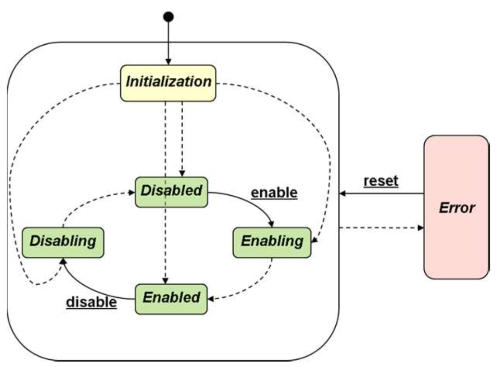
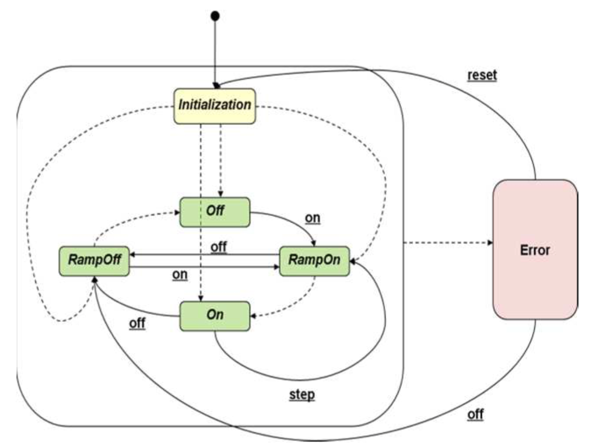

****************************
Multi-Channel Power Supplies
****************************

An efficient implementation of a multi-channel power supply requires using
both *driver* and *middle-layer* APIs. This is necessary because these supplies
are frequently organized in crates, holding multiple supplies, in turn providing
multiple channels, which may be both largely different or similar. Accordingly,
three hierarchy levels exist on the hardware side:

- the crate, which provides the communication interface and acts as a type of
  *controller*.

- the supply, which has *global* attributes, but also exposes individual channels

- the individual channels, which even within a single supply may power distinct
  hardware connected to them.

Additional hierarchy exists on the software side:

- channels may be group to represent a hardware component or subcomponent
- groups of channels may need to be configured and ramped simultanously.
- logical groups of channels may be physically split over multiple supplies
- individual channels may need to be exposed as a separate software device even
  though they belong to the same supply or crate.

Implementing these hiearchy levels is examplary shown on MPOD devices in the
following.

MPOD Devices
============

MPOD devices are multi-channel power supplies which follow the crate-supply-channel
hierarchy just introduced. Communication to the MPOD crate is established
via SNMP, decribed in more detail in Section :ref:`snmp`. The crate device
is implemented as a *bound* API device, which queries the crate for a
list of supplies and channels present on it. Using schema injection it then
generates a flat hierarchy of these channels in the karabo software device.

The crate device implements an FSM which matches its enabled and disabled states,
the latter disabling power on all channels.

User interaction should usually not happen through this device, but rather
using *middle-layer* devices which regroup the channels exposed through the
crate device. These implement a simple FSM which represents ramping of channels
and maintaining them at a set voltage/current:

Implementing of channels into middle-layer device may be done either manually,
or using ``DeviceNode`` functionality:

.. code-block:: Python

    class ChannelGroup(Device):

        #the default is to only monitor state
        controller = String(displayedName="Controller id")
        channels = VectorString(displayedName="Channels in group")
        channelgroup = DeviceNode(displayedName="Channel group")

        def onInitialization(self):
            self.connectDeviceNode(self.channelgroup, self.controller,
                                   properties=self.channels)

        @Slot()
        def evaluateGroupState(self):
            states = [c.state for i,c in self.channelgroup.iteritems()]
            self.state = states.returnMostSignificant(state)

Additional middle-layer devices should then be used to drive these channels
in a coordinated fashion.

The aforementioned scenario represents a composition of multiple channels
exposed by the MPOD controller device.

The opposite scenario is a decomposition, in which a single channel, or multiple
individual should be exposed in a middle-layer device. For this the ``DeviceNode``
property should be used:

.. code-block:: Python

    class IndividualChannel(Device):

        #the default is to only monitor state
        controller = String(displayedName="Controller id")
        channel = String(displayedName="Channel")
        channelRep = DeviceNode(target="root")

        def onInitialization(self):
            self.connectDeviceNode(self.channelgroup, self.controller,
                      properties=[self.channel],
                      commands = [("{}_ramp".format(self.channels), "ramp")])

.. todo::

    This needs to be verified when deviceNodes are implemented.
