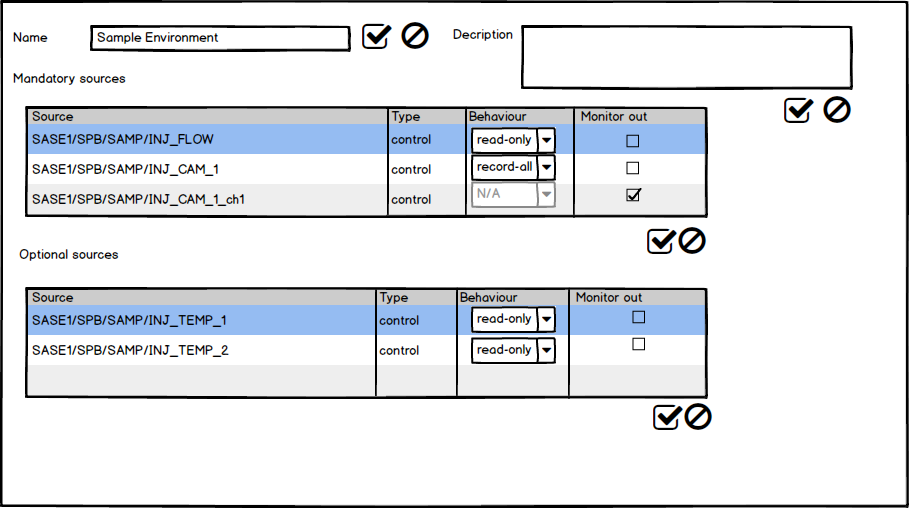
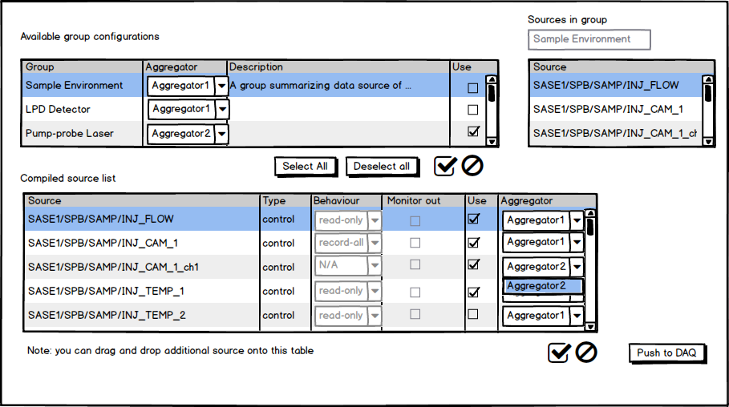

.. _run_configuration:

*****************
Run Configuration
*****************

Data Sources
============

The atomic unit of run configuration is the data source. All slow
control properties of a device, as defined in its expected parameters section,
constitute a single data source. Specifically, these are all properties which
update through messaging over the centralized message broker. Slow control
data sources are called *control data*.

Additionally, every pipelined processing output channel of a device is
considered a separate data source. These channels are expected to output
data train-wise and follow the structure definition as given in [to be added].
Output channels are defined as *instrument data*.

Run Configuration
=================

Run configuration is performed on three levels in XFEL/Karabo:

1. On the first level group-wise configuration is performed. Groups in this
   sense are e.g. a specific large detector, the sample environment, or other
   logically connected devices. They may or may not map directly to component
   groups as specified in the naming convention.
   The group level configuration has two configuration fields: one
   expert-accessible, which system integrators can use to define data sources
   that should always be persisted; and one user configurable, where users
   can configure additional data sources. For either field data sources are
   added by dropping device instances from the manager view onto the
   configuration widget. The entries are automatically expanded to include
   output channels as separate instrument data sources in the list and the
   device as a control data source.
   For each data source the following attributes are available:

   * Type [control/instrument]: a read-only attribute specifying if the data
     source is considered instrument or control data.

   * Behavior [ignore/read-only/record-all]: determines which slow control
     properties are to be recorded. In ignore-mode a static snap-shot of the
     device properties at the begin of the run is recorded. In read-only mode
     updates to read-only properties are recorded in addition to the init-mode
     snapshot. Record-all finally records all properties in addition to the
     init-snapshot. Selected Karabo internal properties, as defined in the
     device base class are omitted from all records. This setting has no
     effect for instrument data.

   * Output to monitor [true/false]: if selected data will be output to the
     online pipeline outputs in the DAQ's monitoring and recording states.

   A group configuration scene used for run configuration.The top table shows
   expert configurations for mandatory data sources, the bottom table user
   selectable data sources. Note that new sources can be dropped to both
   tables from the navigation panel. The device at *SASE1/SPB/SAMP/INJ_CAM_1*
   has been automatically expanded to *control* and *instrument* parameters.

2. Component level run configuration is aggregated in a RunConfigurator device,
   of which a single instance exists within each Karabo domain. This device lists
   the available group configurations, and allows users to select the
   ones to include in the overall run configuration. For each group
   configuration the user/system integrator is expected to also specific the
   data aggregator, which will persist this source. Choices are given through
   a drop down field, which lists all all available aggregator devices
   in the current domain's system topology.

   All selected component configurations are expanded by the device into a flat
   list of sources, available through a separatefield, by using the following
   set of rules:

   * data sources in each component configuration are considered uniquely
     identifiable

   * data sources appearing in multiple component configurations are merged
     such that the most inclusive behavior is chosen. Here *record-all* is
     considered more inclusive than *read-only* is more inclusive than *ignore*.
     For the monitoring flag, *monitor out* enabled is considered more
     inclusive.

   * for all sources in a group configuration the data aggregator
     assigned to this group configuration is used as the default aggregator
     for source in the expanded group. Users may however chose a different
     aggregator for individual sources afterwards. This is e.g. useful if
     a single source within a group is known to produce high data rates.

   By default all user selectable sources are selected to be used when the
   group configuration is added to the overall run configuration. Users may
   deselect individual source from the flattened list.

   This list is published to the pc layer devices in a modified form
   (described below) upon user request. During this step any deselected data
   sources are filtered out.

   The run configurator panel. The top table lists the group configurations
   available in this Karabo domain. The table to its right gives an overview
   of all source contained in a particular group. The bottom panel gives
   the evaluated composed list of source from all groups. Users may drag
   and drop additional sources to this list from the navigation view. Clicking
   *Push to DAQ* updates the run configuration on the run controller.

The modified form is a Hash of the following structure:

.. graphviz::

    digraph g {
        rankdir=LR;
        ordering=out;
        node [shape=box];
        ".....";
        "aggregatorB";
        "aggregatorA";
        "aggregatorA" -> "deviceId1";
        "deviceId1" -> "propertyA";
        "deviceId1" -> "propertyB";
        "deviceId1" -> "propertyC";
        "propertyC" -> "propertyC1";
        "propertyC" -> "propertyC2";
        "propertyC" -> "...";
        "aggregatorA" -> "deviceId2";
        "aggregatorA" -> "....";
        "aggregatorB" -> "deviceId3";

    }

Data sources may be assigned to only a single aggregator.  For each property
entry the following attributes are inferred from the Karabo device Schema:

* displayed name
* description
* alarm bounds
* unit
* metric prefix
* pipeline output

Property entries do not contain any time-related information. They are typed
according to their Karabo type and have an undefined value
(frequently zero, or a zero-length vector).

For each device entry the following attributes are added:

* class id/name
* version

On the property level nested Hashes are used for nested property structures.
The device id is not nested by domain, e.g. it is a single string key of form
`DOMAIN/CLS/DEVICE_A_B` is used. Properties that refer to output channels
additionally have a `pipelineOutput` attribute set to `true`.

3. The run controller on the PC-layer uses this hash to reconfigure the
   aggregators (and other services) upon receiving a newly pushed configuration.
   Pushing is accomplished via a signal that the runConfigurator connects the
   runController to. Handling of the received data is internal to the devices,
   which are under ITDM responsibility. The run controller limits application
   of new run configurations to the *ignore* state. Configurations pushed in
   other states will be ignored and an alarm will be raised on the run controller
   device, indicating that the configuration was not applied.
