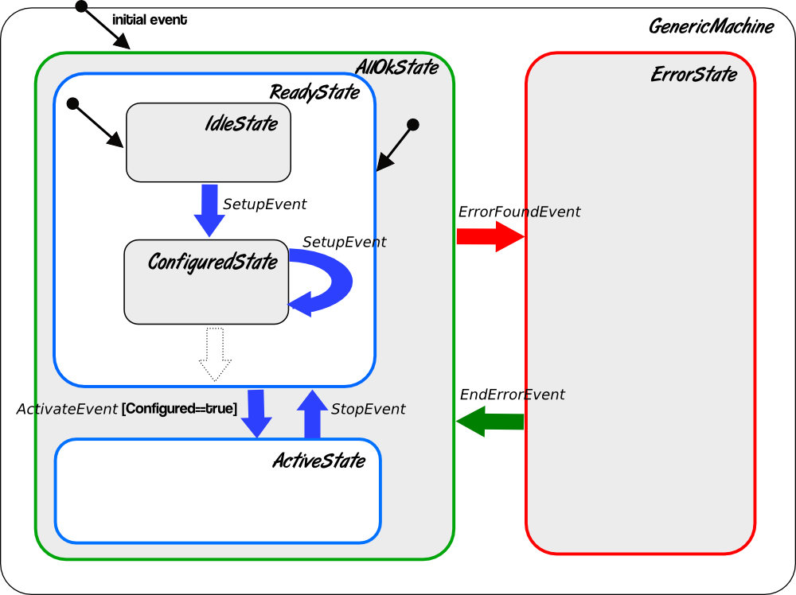
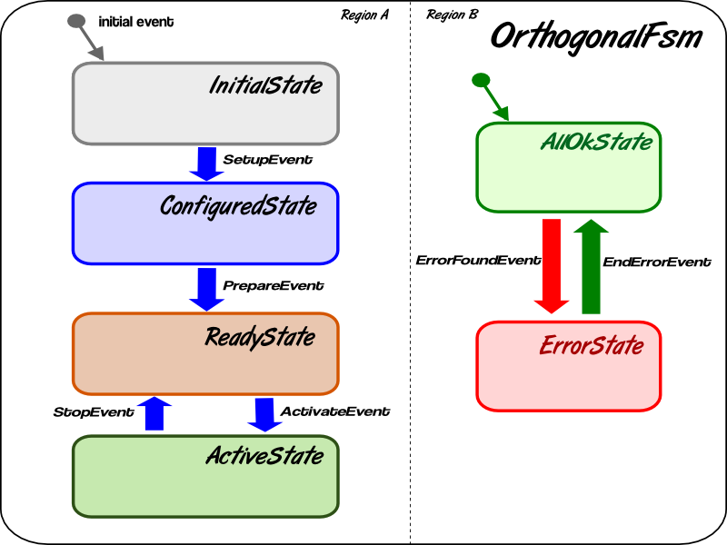

.. include:: colors.rst

.. _states:

****************************
States and Statuses
****************************

Karabo has a fixed set of provided states, all of which are listed in the
tables below. *States* are classified in *base states*, which can be seen
as set of more general states, and *device type states*, which map closer
to the type of hardware being controlled or to certain types
of software devices, but also always map to a base state. Each base state has a
assigned color coding, making it easy to view are devices state at first
glance.
Device, type, base and meta states connections can be seen as a form
or inheritance as given in the below diagram:

.. digraph:: state_transitions

    "UNKNOWN"[shape = box style=filled, fillcolor="#FFAA00"]
    "DISABLED"[shape = box style=filled, fillcolor="#FF00FF"]
    "ERROR"[shape = box style=filled, fillcolor=red]
    "INIT"[shape = box style=filled, fillcolor="#E6E6AA"]
    "KNOWN"[shape = box style=filled, fillcolor="#C8C8C8"]
    "STATIC"[shape = box style=filled, fillcolor="#00AA00"]
    "NORMAL"[shape = box style=filled, fillcolor="#C8C8C8"]
    "KNOWN" -> "NORMAL"
    "KNOWN" -> "ERROR"
    "KNOWN" -> "DISABLED"
    "NORMAL" -> "STATIC"
    "NORMAL" -> "RUNNING"
    "RUNNING"[shape = box style=filled, fillcolor="#99CCFF"]
    "PASSIVE"[shape = box style=filled, fillcolor="#CCCCFF"]
    "STATIC" -> "PASSIVE"
    "ACTIVE"[shape = box style=filled, fillcolor="#78FF00"]
    "STATIC" -> "ACTIVE"
    "CHANGING"[shape = box style=filled, fillcolor="#00AAFF"]
    "NORMAL" -> "CHANGING"
    "DECREASING"[shape = box style=filled, fillcolor="#00AAFF"]
    "CHANGING" -> "DECREASING"
    "INCREASING"[shape = box style=filled, fillcolor="#00AAFF"]
    "CHANGING" -> "INCREASING"

As is apparent from the diagram an additional hierarchy level exists for the
``STATIC`` and ``CHANGING`` states. Furthermore, the ``ACTIVE`` and ``PASSIVE``
base states may seem a bit weird. This is due to the fact, that frequently
hardware functionality has a somewhat binary scope, e.g. a channel can be
powered (on) or not (off), a valve can be open or closed, but even for two
similar devices this may map differently to e.g. voltage applied on an output
or not. By using the simple approach of a binary system for base states there
is clear indication that a more meaningful *device state* derived from these
should be used in the concrete device implementation. Both will however compare
equal to the ``STATIC`` state, i.e. the hardware is in fact maintaining a
defined state.

Base and meta states are defined as follows:

.. graphviz::

    digraph unknown {UNKNOWN [shape=box, style=filled, fillcolor="#FFAA00"]}

``UNKNOWN`` should be used if the Karabo device has no connection to hardware,
or it cannot be assured that the correct state of the hardware is reported by
the device. The latter can be e.g. the case if an unknown software error
occurs in the device code, which is only caught by the Karabo Framework
code and not by the device code.

.. graphviz::

    digraph init {INIT [shape=box, style=filled, fillcolor="#E6E6AA"]}

The ``INIT`` state in which a Karabo device should transition into upon
initialization. During initialization connection to the hardware should
be established. After initialization the hardware state should thus
be ``KNOWN``, and the device should transition either to ``DISABLED``,
``ERROR`` or one of the states derived from ``NORMAL``, all of which derive
from ``KNOWN``. If no connection can be established the device should be placed
into the ``UNKNOWN state``.

The ``KNOWN`` base state is the counterpart to the ``UNKNOWN`` state and should
not usually be entered programmatically. Rather
while in ``INIT`` the device logic should decide which of the states deriving
from ``KNOWN`` should be entered. All states listed in the following derive
from it and will compare equal to it:

.. graphviz::

    digraph disabled {DISABLED [shape=box, style=filled, fillcolor="#FF00FF"]}

``DISABLED`` is used if the device is will not act on commands and assignment
for some reason, e.g. due to manual override or an interlock condition preventing
the device from being used. A disabled device is however connected to the
Karabo system, i.e. (some) value may be read back, at the very least it
is able to notify Karabo of its disabled status. Note that no ``ENABLED``
state exists, a device which is enabled is either in one of the ``NORMAL``
states or in the ``ERROR`` state.

.. graphviz::

    digraph error {ERROR [shape=box, style=filled, fillcolor=red]}

The ``ERROR`` state is reserved for hardware errors and uncaught processing
errors on pipelined-processing devices. It should only be used for an
error pertinent to the hardware component, not for indicating an alarm
condition due to e.g. a property measured by the hardware. The latter case
is handled via alarm conditions in Karabo. Note that no ``OK``
state exists, a device which is working normally is in one of the
``NORMAL`` states.

.. graphviz::

    digraph NORMAL {NORMAL [shape=box, style=filled, fillcolor="#C8C8C8"]}

The ``NORMAL`` base state should not usually be entered programmatically.
Similar to ``KNOWN``, device logic should rather transition the device
into one of the derived states. The following states derive from and compare
equal to ``NORMAL``:

.. graphviz::

    digraph static {STATIC [shape=box, style=filled, fillcolor="#00AA00"]}

``STATIC`` is itself a base state to the ``ACTIVE`` and ``PASSIVE`` states.
It may however also directly be used, e.g. if a device is connected but
waiting on commands.
It is the counterpart to the changing states. Devices in a static operating
mode, e.g. a running turbo-pump which is at target speed are also in the
``STATIC`` state.

.. graphviz::

    digraph active {ACTIVE [shape=box, style=filled, fillcolor="#78FF00"]}

The ``ACTIVE`` state is derived from ``STATIC`` and should usually be used
only for comparison purposes. Rather developers should transition into a device
state derived from it. It is the counterpart to ``PASSIVE``.

.. graphviz::

    digraph passive {PASSIVE [shape=box, style=filled, fillcolor="#CCCCFF"]}

The ``PASSIVE`` state is derived from ``STATIC`` and should usually be used
only for comparison purposes. Rather developers should transition into a
device state derived from it. It is the counterpart to ``ACTIVE``.

.. graphviz::

    digraph running {RUNNING [shape=box, style=filled, fillcolor="#99CCFF"]}

The state ``RUNNING`` is a base state is related to data acquisition devices.
This base state has two children, ``ACQUIRING`` and ``PROCESSING`` and is
colored blueish to indicate that data is flowing.
The ``ACQUIRING`` state is essentially used for detector devices when the data
acquisition is active, while the ``PROCESSING`` state is present in downstream
pipeline devices to show they are receiving and processing the detector data.

.. graphviz::

    digraph changing {CHANGING [shape=box, style=filled, fillcolor="#00AAFF"]}

The state ``CHANGING`` is a base state to the ``INCREASING`` and
``DECREASING`` states. It may however  also directly be used, e.g. if a device
is changing in a way that a directional indication does not make sense. It is
the counterpart to the ``STATIC`` state. ``CHANGING`` and derived states should
be used when a device is transitioning to a new target condition, e.g. a motor
moving to a new position, a power supply ramping to a given voltage or a pump
spinning up to speed. Once the target value is reached the device should
transition into a ``STATIC`` state.

.. graphviz::

    digraph increasing {INCREASING [shape=box, style=filled, fillcolor="#00AAFF"]}

The state ``INCREASING`` is derived from ``CHANGING`` and should be used if
it makes sense to indicate a directional transition of the hardware.
It is the counterpart to ``DECREASING``.

.. graphviz::

    digraph decreasing {DECREASING [shape=box, style=filled, fillcolor="#00AAFF"]}

The state ``DECREASING`` is derived from ``CHANGING`` and should be used
if it makes sense to indicate a directional transition of the hardware.
It is the counterpart to ``INCREASING``.

.. warning::

    The ``ERROR`` state is reserved for hardware errors. Errors due to
    communication problems or software errors should result in a transition
    into the ``UNKNOWN`` state. Generally though, software errors should not
    occur and if they do the device should recover into an operational
    mode. Composite devices should transition to ``UNKNOWN`` if they are not
    able to contact a device they are to control, as they might not have
    all the information available to work properly.

.. note::

    As is evident from the list there is no ``FOLLOWING`` state in Karabo.
    A device which operates in a closed-regulatory loop should be in
    the ``CHANGING`` state or one of the derived states as long as it is
    not on-target, and then transition ``STATIC`` or a state derived there-of.
    This also means that if a change of target value is to be allowed while
    the device is still changing to a previously set target value, the slot
    initiating the move needs to have ``CHANGING`` as an allowed state.
    See Section :ref:`open_closed_loop` for details.

.. warning::

    As is evident from the list there is no ``CONNECTED`` state. Devices
    requiring to establish connections to hardware first, e.g. through the
    network, or some other interface, do this either in the ``INIT`` state.
    Connection functionality should be implemented in the initialization hooks,
    **not** in the constructor or ``__init__`` methods, as it may take time,
    and would otherwise yield the device unresponsive.

The following diagram shows how base-states and base states are connected,
and which transitions are allowed. Upon initialization devices generally
transition from ``UNKNOWN`` into one of the states derived from the ``KNOWN``
base state. This is done by passing through the ``INIT`` state, where the
connection to hardware should be established. Note that a connection error
should not put the device into an ``ERROR`` state but rather back into
``UNKNOWN``.

As shown in the diagram a transition to any of the states deriving from
the ``KNOWN`` base state back to ``UNKNOWN`` is possible, this should e.g.
occur if the connection to the hardware is lost. Restablishing a ``KNOWN`` state
should happen by passing through the ``INIT`` state``.

The ``ERROR`` and ``DISABLED`` states may be transitioned into from any of the
states deriving from the ``NORMAL`` base state. Conversely, the device may
implement logic to recover from an ``ERROR`` state into any of the ``NORMAL``
-derived states, or from ``DISABLED`` into these.

.. graphviz::

    digraph state_uml {

        compound=true;
        rankdir = LR;
        graph [pad="1.", ranksep="0.95", nodesep="1.2", splines=ortho];
        unknown
        [
            shape = box
            style = filled
            fillcolor = "#FFAA00"
            label = "UNKNOWN"
        ]

        init
        [
            shape = box
            style = filled
            fillcolor = "#E6E6AA"
            label = "INIT"
        ]

        subgraph cluster1 {

        label = "KNOWN";

        disabled
        [
            shape = box
            style = filled
            fillcolor = "#FF00FF"
            label = "DISABLED"
        ]

        error
        [
            shape = box
            style = filled
            fillcolor = red
            label = "ERROR"
        ]

            subgraph cluster0 {

                label = "NORMAL";
                on
                [
                    shape = box
                    style = filled
                    fillcolor = green
                    label = "ACTIVE"
                ]

                changing
                [
                    shape = box
                    style = filled
                    fillcolor = "#00AAFF"
                    label = "CHANGING"
                ]
                on -> changing
                changing -> on
            }
        }

        unknown -> init

        on -> unknown [ltail=cluster1]
        init -> on [lhead=cluster1];
        init -> unknown

        on -> error [ltail=cluster0]
        error ->  on [lhead=cluster0]

        disabled -> error
        error -> disabled
        disabled -> on [lhead=cluster0]
        on -> disabled [ltail=cluster0]

    }

Most Significant State
======================

Especially for middle-layer devices a recurring scenario is the evaluation of
the most significant state, or composite state, of a group of states. This is
where state trumping comes into play. In Karabo, state trumping is centralized
in the sense that a set of standard trumping rules are provided, giving the
base states are particular order.
In the flat base-state hierarchy the following graph is being followed
in *trump* evaluation, where ``DISABLED`` is trumped by all other states and
``UNKNOWN`` will trump all other states.

.. graphviz::

    digraph state_trumps {

        rankdir = LR;
        compound=true;
        graph [pad="1.", ranksep="0.95", nodesep="1.2", splines=ortho];

        disabled
        [
            shape = box
            style = filled
            fillcolor = "#FF00FF"
            label = "DISABLED"
        ]

        subgraph cluster0 {
            label = "STATIC";
            style = filled
            fillcolor = "#00AA00"

            active
            [
                shape = box
                style = filled
                fillcolor = "#78FF00"
                label = "ACTIVE"
            ]

            passive
            [
                shape = box
                style = filled
                fillcolor = "#CCCCFF"
                label = "PASSIVE"
            ]

            active->passive [arrowhead=none, style=dashed]

        }

        running
        [
            shape = box
            style = filled
            fillcolor = "#99CCFF"
            label = "RUNNING"
        ]

        subgraph cluster1 {
            label = "CHANGING";
            style = filled
            fillcolor = "#00AAFF"

            increasing
            [
                shape = box
                style = filled
                fillcolor = "#00AAFF"
                label = "INCREASING"
            ]

            decreasing
            [
                shape = box
                style = filled
                fillcolor = "#00AAFF"
                label = "DECREASING"
            ]

            increasing->decreasing [arrowhead=none, style=dashed]

        }

        init
        [
            shape = box
            style = filled
            fillcolor = "#E6E6AA"
            label = "INIT"
        ]

        interlocked
        [
            shape = box
            style = filled
            fillcolor = "#FF00FF"
            label = "INTERLOCKED"
        ]

        error
        [
            shape = box
            style = filled
            fillcolor = red
            label = "ERROR"
        ]

        unknown
        [
            shape = box
            style = filled
            fillcolor = "#FFAA00"
            label = "UNKNOWN"
        ]

        disabled -> active [lhead=cluster0]
        active  -> running [ltail=cluster0]
        running -> increasing [lhead=cluster1]
        decreasing -> interlocked [ltail=cluster1]
        interlocked -> error
        error -> init
        init -> unknown

    }

.. warning::

    The ``UNKNOWN`` state purposely trumps all other states, as the device is
    in a condition in which it does not have all the information necessary
    to determine the proper state. Thus the conservative assumption is
    that the device is in an error state.
    If a device is controlling hardware known to be disconnected, used as
    a spare, or not working, it should be brought to into the ``DISABLED``
    state. In this case it is ignored for composite state determination, as
    this state is trumped by all other states.

Users should however not implement trumping functionality themselves,
but instead use the ``StateSignifier().returnMostSignificant`` function
provided by Karabo.

.. code-block:: Python

    from karabo.middlelayer import State, StateSignifier

    trumpState = StateSignifier()

    listOfStates = [State.ERROR, State.MOVING, State.CHANGING]
    definingState = trumpState.returnMostSignificant(listOfStates)
    print(definingState)
    >>> State.ERROR

Calling ``returnMostSignificant`` from the ``StateSignifier`` without
additional keywords will result in returning evaluation substates
of ``STATIC`` and ``CHANGING`` as these base states, i.e. no differentiation
between ``ACTIVE`` and ``PASSIVE`` or ``INCREASING`` and ``DECREASING`` is
made. If a differentiation is needed it can be controlled by the following
two keywords:

staticSignificant = ``ACTIVE|PASSIVE``
    defines whether ``ACTIVE`` or  ``PASSIVE`` should evaluate as more significant.

changingSignificant = ``INCREASING|DECREASING``
    defines whether ``INCREASING`` or  ``DECREASING`` should evaluate as more significant.

.. note::

    ``returnMostSignificant`` from the ``StateSignifier`` works also with
    derived states like ``MOVING``, as shown in the example, and will also
    return the derived state, if it is most significant. It is good practice
    to always compare the defining state against one of the base states,
    i.e. here ``if definingState == CHANGING``.

In rare scenarios states might to be trumped differently. Developers can
provide for a different trumping method in initialization of the ``StateSignifier``.
It expects a complete list of base states as input, the order of which determines
trumping and provides the same ``returnMostSignificant`` method as in the
default trumping implementation.

.. code-block:: Python

    from karabo.middlelayer import State, StateSignifier

    trumpList = []
    trumpList.append(State.DISABLED)
    trumpList.append(State.STATIC)
    trumpList.append(State.CHANGING)
    trumpList.append(State.INIT)
    trumpList.append(State.UNKNOWN)
    trumpList.append(State.ERROR)
    myStateSignifier = StateSignifier(trumpList)

    sState = myStateSignifier.returnMostSignificant([State.DISABLED,
                                                     State.INIT])

Derived States
==============

For certain device classes conventions on common state names have
historically grown. Karabo supports these existing state names, by providing
derived states. The diagrams below list these states, in terms
of from the base states they derive.

Interlocked Devices
-------------------

A device which may not be altered because it is in an ``INTERLOCKED`` state is
in a state derived from ``DISABLED``:

.. digraph:: state_transitions

    "DISABLED"[shape = box style=filled, fillcolor="#FF00FF"]
    "INTERLOCKED"[shape = box style=filled, fillcolor="#FF00FF"]

    "DISABLED" -> "INTERLOCKED"

.. note::

    Although the ``INTERLOCKED`` state derives from the ``DISABLED`` state, it
    is much more significant and is trumped by ``State.ERROR``, ``State.INIT`` and
    ``State.UNKNOWN``.

Devices with Binary-like behavior
---------------------------------

Many hardware devices have states which map to a kind of "binary" behavior,
i.e. two states which are the opposite or counterpart of each other, thus
deriving from ``ACTIVE`` and ``PASSIVE``. In each of this states the device
is rather ``STATIC``, which is the base state for both:

.. digraph:: state_transitions

    rankdir = LR;

    "STATIC"[shape = box style=filled, fillcolor="#00AA00"]
    "PASSIVE"[shape = box style=filled, fillcolor="#CCCCFF"]
    "ACTIVE"[shape = box style=filled, fillcolor="#78FF00"]

    "COOLED"[shape = box style=filled, fillcolor="#78FF00"]
    "WARM"[shape = box style=filled, fillcolor="#CCCCFF"]

    "WARM"->"PASSIVE" [dir=back]

    "HEATED"[shape = box style=filled, fillcolor="#78FF00"]
    "COLD"[shape = box style=filled, fillcolor="#CCCCFF"]

    "COLD"->"PASSIVE" [dir=back]

    "EVACUATED"[shape = box style=filled, fillcolor="#78FF00"]
    "PRESSURIZED"[shape = box style=filled, fillcolor="#CCCCFF"]

    "PRESSURIZED"->"PASSIVE" [dir=back]
    "ACTIVE"->"EVACUATED"

    "OPENED"[shape = box style=filled, fillcolor="#78FF00"]
    "CLOSED"[shape = box style=filled, fillcolor="#CCCCFF"]

    "CLOSED"->"PASSIVE" [dir=back]

    "ON"[shape = box style=filled, fillcolor="#78FF00"]
    "OFF"[shape = box style=filled, fillcolor="#CCCCFF"]

    "OFF"->"PASSIVE" [dir=back]

    "EXTRACTED"[shape = box style=filled, fillcolor="#78FF00"]
    "INSERTED"[shape = box style=filled, fillcolor="#CCCCFF"]

    "INSERTED"->"PASSIVE" [dir=back]

    "STARTED"[shape = box style=filled, fillcolor="#78FF00"]
    "STOPPED"[shape = box style=filled, fillcolor="#CCCCFF"]

    "STOPPED"->"PASSIVE" [dir=back]

    "LOCKED"[shape = box style=filled, fillcolor="#78FF00"]
    "UNLOCKED"[shape = box style=filled, fillcolor="#CCCCFF"]

    "UNLOCKED"->"PASSIVE" [dir=back]

    "ENGAGED"[shape = box style=filled, fillcolor="#78FF00"]
    "DISENGAGED"[shape = box style=filled, fillcolor="#CCCCFF"]

    "DISENGAGED"->"PASSIVE" [dir=back]

    "PASSIVE" -> "STATIC"[dir=back]
    "STATIC" -> "ACTIVE"

    "ACTIVE"->"LOCKED"
    "ACTIVE"->"STARTED"
    "ACTIVE"->"EXTRACTED"
    "ACTIVE"->"ON"
    "ACTIVE"->"OPENED"
    "ACTIVE"->"HEATED"
    "ACTIVE"->"COOLED"
    "ACTIVE"->"ENGAGED"

Devices with Transitionatory Behavior
-------------------------------------

Frequently, a transition from one hardware state to another will not be immediate,
but rather take some time, e.g. if a stage is instructed to driver to a new
location, a power supply is ramping to a new voltage or a chiller is set to
a lower temperature. During a longer lasting transition such devices should be
placed into a ``CHANGING`` derived state, possibly also indicating if an increase
or decrease of the value is being performed.

.. digraph:: state_transitions

    rankdir = LR;

    subgraph cluster0{

        rank="same";
        style = invis;
        "ROTATING"[shape = box style=filled, fillcolor="#00AAFF"]
        "CHANGING"[shape = box style=filled, fillcolor="#00AAFF"]
        "MOVING"[shape = box style=filled, fillcolor="#00AAFF"]

        "SWITCHING"[shape = box style=filled, fillcolor="#00AAFF"]

        "ROTATING" -> "CHANGING"[constraint=false, dir=back]
        "CHANGING" -> "MOVING" [constraint=false]
        "CHANGING" -> "SWITCHING"[constraint=false]

    }

    "INCREASING" -> "MOVING" [style="invisible",dir="none"];
    "INCREASING" -> "ROTATING" [style="invisible",dir="none"];
    "INCREASING" -> "SWITCHING" [style="invisible",dir="none"];

    "INCREASING"[shape = box style=filled, fillcolor="#00AAFF"]
    "DECREASING"[shape = box style=filled, fillcolor="#00AAFF"]

    "COOLING"[shape = box style=filled, fillcolor="#00AAFF"]
    "HEATING"[shape = box style=filled, fillcolor="#00AAFF"]

    "MOVING_LEFT"[shape = box style=filled, fillcolor="#00AAFF"]
    "MOVING_RIGHT"[shape = box style=filled, fillcolor="#00AAFF"]
    "MOVING_DOWN"[shape = box style=filled, fillcolor="#00AAFF"]
    "MOVING_UP"[shape = box style=filled, fillcolor="#00AAFF"]
    "MOVING_FORWARD"[shape = box style=filled, fillcolor="#00AAFF"]
    "MOVING_BACK"[shape = box style=filled, fillcolor="#00AAFF"]

    "ROTATING_CLK"[shape = box style=filled, fillcolor="#00AAFF"]
    "ROTATING_CNTCLK"[shape = box style=filled, fillcolor="#00AAFF"]

    "RAMPING_DOWN"[shape = box style=filled, fillcolor="#00AAFF"]
    "RAMPING_UP"[shape = box style=filled, fillcolor="#00AAFF"]

    "EXTRACTING"[shape = box style=filled, fillcolor="#00AAFF"]
    "INSERTING"[shape = box style=filled, fillcolor="#00AAFF"]

    "STOPPING"[shape = box style=filled, fillcolor="#00AAFF"]
    "STARTING"[shape = box style=filled, fillcolor="#00AAFF"]

    "EMPTYING"[shape = box style=filled, fillcolor="#00AAFF"]
    "FILLING"[shape = box style=filled, fillcolor="#00AAFF"]

    "DISENGAGING"[shape = box style=filled, fillcolor="#00AAFF"]
    "ENGAGING"[shape = box style=filled, fillcolor="#00AAFF"]

    "SWITCHING_OFF"[shape = box style=filled, fillcolor="#00AAFF"]
    "SWITCHING_ON"[shape = box style=filled, fillcolor="#00AAFF"]

    "HEATING"->"INCREASING" [dir=back]
    "MOVING_RIGHT"->"INCREASING" [dir=back]
    "MOVING_UP"->"INCREASING" [dir=back]
    "MOVING_FORWARD"->"INCREASING" [dir=back]
    "ROTATING_CLK"->"INCREASING" [dir=back]
    "RAMPING_UP"->"INCREASING" [dir=back]
    "INSERTING"->"INCREASING" [dir=back]
    "STARTING"->"INCREASING" [dir=back]
    "FILLING"->"INCREASING" [dir=back]
    "ENGAGING"->"INCREASING" [dir=back]
    "SWITCHING_ON"->"INCREASING" [dir=back]

    "INCREASING" -> "CHANGING"[dir=back]
    "CHANGING" -> "DECREASING"

    "DECREASING" -> "COOLING"
    "DECREASING" -> "MOVING_LEFT"
    "DECREASING" -> "MOVING_DOWN"
    "DECREASING" -> "MOVING_BACK"
    "DECREASING" -> "ROTATING_CNTCLK"
    "DECREASING" -> "RAMPING_DOWN"
    "DECREASING" -> "EXTRACTING"
    "DECREASING" -> "STOPPING"
    "DECREASING" -> "EMPTYING"
    "DECREASING" -> "DISENGAGING"
    "DECREASING" -> "SWITCHING_OFF"

Devices Interacting with Personal Interlock
-------------------------------------------

Karabo devices may monitor and request actions upon the personal interlock
system of the hutches. For these devices the following mapping to base states
should be used.

.. digraph:: state_transitions

    rankdir = LR;

    "CHANGING"[shape = box style=filled, fillcolor="#00AAFF"]
    "SEARCHING"[shape = box style=filled, fillcolor="#00AAFF"]

    "STATIC"[shape = box style=filled, fillcolor="#00AA00"]
    "INTERLOCK_OK"[shape = box style=filled, fillcolor="#00AA00"]

    "DISABLED"[shape = box style=filled, fillcolor="#FF00FF"]
    "INTERLOCK_BROKEN"[shape = box style=filled, fillcolor="#FF00FF"]

    "CHANGING" -> "SEARCHING"
    "STATIC" -> "INTERLOCK_OK"
    "DISABLED" -> "INTERLOCK_BROKEN"

.. note::

    While comparisons between different derived states are guaranteed to work
    it is good practice to always compare to the base state. You should thus
    write ``if myState == State.CHANGING`` and **not**
    ``if myState == State.MOVING``!

Changing States
===============

The device state should be queried and set using the *getState()*
and *updateState()* methods in the *bound* APIs

.. code-block:: Python

    currentState = self.getState()
    ...
    self.updateState(State.MOVING)

In the *middle-layer* API normal property retrieval and assignment will
automatically map to these calls

.. code-block:: Python

    currentState = self.state
    self.state = State.MOVING

.. warning::

    While the device state is just another property on the device it is not
    available via usual *get* and *set* commands. This has two reasons:

    - state updates are propagated via a dedicated signal to the distributed
      system, allowing to listen on state updates of other devices without
      consuming network-bandwith on updates from other devies property

    - while internally states are serialized as strings, states can only be
      updated by assigning a state enumerator object.

Statuses
========

The states introduced above are meant to be unified; accordingly, only a relatively
small number of states has been defined. While it should always be possible to match
a device state to one of the predefined-states, it can be useful to convey more specific
information. For this the device status property is to be used, which is can be set
to any string value using the normal assignment and retrieval syntax in the *bound* APIs:

.. code-block:: Python

   print(self.get("status"))
   self.set("status", "The device is running")

or in the middle-layer API:

.. code-block:: Python

   print(self.status)
   self.status = "The device is running"

On a state update a text indicating the device state is automatically set. After update
state the user may overwrite the status again.

.. code-block:: Python

   self.updateState(State.RUNNING)
   print(self.get("status"))
   >> The device is in the RUNNING state.
   self.set("status", "My new status")
   print(self.get("status"))
   >> My new status

.. _stateMachines:

The Finite State Machine (FSM)
==============================

As an enhancement to the simple state description just described, Karabo
allows to define a full finite state machine (FSM) for *bound* devices.
The full FSM implementation will check any slot calls which lead to state
transitions if they are allowed for the current source state, and
automatically set the target state after execution of define entry, exit
and transition hooks. To make uses familiar of finite state machine usage
an introduction is given first, followed by examples.

Overview
--------

Finite state machines can be used to model real life system, which for most
non-trivial tasks go through different stages (states) during their
evolution, or during execution of a task. The system may change its state
due to both internal or external events, and subsequent behavior may depend
on the current state on the system.

Models can be used to approximate these states, stimuli and resulting
behavioral changes and define them in terms of a finite set of states, events
and transitions. The result of such an abstraction is a so-called finite
state machine. Here the word *finite* is important, that all expected
behavior fits into the deterministic model describe the system with a finite
set of elements. Conversely, this means that any state not foreseen
as part of the model should be considered faulty behavior and if implemented
in software raise and error.

Karabo's FSM engine
-------------------

Since implementation of FSMs is a recurring task in software development, many already
exist. The Karabo framework uses the implementation found in Boost C++ template library:
the Meta State Machine (MSM).  This choice was recognized to be attractive due to the
following reasons:

* It is a part of the Boost library, available as open source and supported by a string
  developer community.
* The MSM belongs to the class of UML (Unified Modeling Language) state
  machines with full UML support (nested state machines, orthogonal
  regions, anonymous and internal transitions etc.)
* It has good and up-to-date documentation.
* The MSM proposes well readable and terse interface for State Transition
  Diagram (STD) definitions. They are easy to use and conversion from an UML diagram
  to a STD is straightforward.
* The MSM has a front-end/back-end architecture and provides several
  front-ends for STD definitions.
* The MSM uses the template metaprogramming technique and we do not need any
  special precompiler or tool but just a plain C++ compiler. Most of the
  problems can already be discovered during compile time.
* It offers high performance.

As a disadvantage we should mention:

* Sometimes you may have limitations on a number of states handled.
* The compilation time may increase significantly depending on
  complexity of STD and chosen front-end.

State machine glossary
----------------------

It is highly recommended to read MSM
`user's guide <http://www.boost.org/doc/libs/1_57_0/libs/msm/doc/HTML/index.html>`_  or
at least the `UML Short Guide and Tutorial <http://www.boost.org/doc/libs/1_57_0/libs/msm/doc/HTML/ch02.html>`_,
which are available on the boost MSM site. Here, for your convenience, we cite the
glossary that can be found in MSM documentation:

state machine
  The life cycle of a device, hard or software. It is made of a finite
  number of states, nested sub-machines, regions, transitions and
  acts on incoming events. It may have entry and exit behaviors.

FSM
  An abbreviation of **F**\ inite **S**\ tate **M**\ achine

STD
  A **S**\ tate **T**\ ransition **D**\ iagram, a description of a
  FSM in graphical form. In UML convention states are indicated as rounded rectangles
  and transitions as arrows. An example is given in :ref:`Figure 1<genericFsm>`

.. _genericFsm:

       **Figure 1.** Example of generic State Transition Diagram.

state
   A stage in the life cycle of a state machine. A state can
   have entry and exit behaviors.

event
   An incident (possibly) provoking a reaction of the state
   machine in terms of changing its current state.

transition
   A specification of how a state machine reacts to an
   event.  It specifies a source state, the event triggering the
   transition, the target state (which will become the newly active state
   if the transition is triggered), guards and actions.

action
   An operation executed during the triggering of the
   transition. The action may be an entry, exit or transition action.

guard
   An operation evaluating to a boolean which prevents the triggering of
   a transition which would otherwise fire.

transition table
   A tabular representation of a state machine. A STD is a
   graphical, but possibly incomplete representation of such a table model.

initial state
   The state in which the state machine (or submachine)
   starts into. Having several orthogonal regions means having as many initial
   states.

sub-machine
   A submachine is a state machine inserted as a state in
   another state machine. It can have multiple occurrences in the statemachine
   it is contained in.

orthogonal regions
   A (logical) parallel flow of execution in a state
   machine. Every region of a state machine gets a chance to process an
   incoming event. In UML graphically represented as a round rectangle separated
   by dashed lines. It is needed when a status of a system during its
   life cycle has to be described not just by one parameter, e.g. parameters in addition
   to the state name See. :ref:`Figure 2 <orthogonalFsm>` as an
   example of a STD with regions.

.. _orthogonalFsm:

       **Figure 2.** STD with orthogonal regions.

terminate pseudo-state
   When this state becomes active, it
   terminates the execution of the state machine. The boost MSM does not
   destroy the state machine as required by the UML standard, however. It thus
   lets you access the state machine's data after termination.

entry/exit pseudo state
   Defined for sub-machines as the connection between a transition into and out of the
   sub-machine in terms of predefined point.

fork
   A fork allows explicit entry into several orthogonal regions
   of a sub-machine.

history
   A history is a way to remember the active state of a
   submachine so that the submachine can continue from its last active state the
   next time it becomes active.

completion events (also called completion/anonymous transitions)
  When a transition has no named event triggering it, it automatically
  fires when the source state is active, unless a guard forbids it.

transition conflict
  A conflict is present if for a given source
  state and incoming event, several transitions are possible.  UML
  specifies that guard conditions have to solve the conflict.

internal transitions
   transition from a state to itself without
   having exit and entry actions being called.  Instead a transition
   action is called.

The STD given in :ref:`Figure 1 <genericFsm>` is an example of
nested state machines: the top state machine GenericMachine
contains two states: *AllOkState* and *ErrorState*.  The AllOkState is not
just a simple state but a subm-achine which in turn contains two states:
*ReadyState* and *ActiveState*.

The ReadyState is a submachine as well and contains and additional
two states: *IdleState* and *ConfiguredState*.  Remember that every state
machine has to be instructed, which state is it initial state.  This
is represented by an arrow with origin of a small circle.  It means
that AllOkState is an initial state of GenericMachine, whereas
ReadyState is the initial state of AllOkState, and IdleState is the initial
state of ReadyState.

In the state machine represented by the diagram this means that the
GenericMachine's the first state will be *IdleState* and the following
actions will be called: entry action for GenericMachine, entry action for
AllOkState, entry action for ReadyState and entry action for IdleState.

The GenericMachine in the figure is driven by the following events:

SetupEvent
  tells the system that it should set itself up, and then change
  from *IdleState* to ConfiguredState, or loop back into ConfiguredState from
  ConfiguredState after a reconfiguration. If the system is in ActiveState
  the SetupEvent will be ignored.

ActivateEvent
  tells the system to go to the ActiveState. Optionally, the guard condition is suffixed
  to the event name, in square brackets, as shown.  It tells that the transition to the
  ActiveState can happen only if the current state nested into
  ReadyState is ConfiguredState.

StopEvent
  returns the system to ReadyState and, therefore, to
  IdleState (initial state).

ErrorFoundEvent
  transfers the state machine into ErrorState
  independent of the current state nested into AllOkState.

EndErrorEvent
  returns the state machine to the AllOkState, then to
  the ReadyState and finally the IdleState, as if a state
  machine had just started.

Another strategy of recovering from an ErrorState is shown in
:ref:`Figure 2 <orthogonalFsm>`. It demonstrates two orthogonal regions,
running in parallel, so that the status of a state machine is
defined by two parameters:

- the state in **region A**
- the state in **region B**.

When the OrthogonalFsm state machine starts, it transitions
to InitialState in region A and to AllOkState in region B.
Subsequent events then drive the state machine to next state in both
regions in parallel. In the example case, the events that drive machine in
region A do not influence the status in region B.  We would expect that if
ErrorFoundEvent is processed by the state machine and the system moves to
ErrorState in region B, we should not continue normal processing in
region A. This is not graphically represented in :ref:`Figure 2<orthogonalFsm>`,
but the ErrorState is implied to be a special state, declared as
a *terminate state* or *interrupt state*. Entering such a *terminate state* results in
termination of state machine in all orthogonal regions.

Entering an *interrupt state* results in all events being clocked except of
EndErrorEvents.  This is useful if you want to model error recovery
for a real system.  After recovery from the error the state of
region A will be restored as it was before ErrorFoundEvent.

In the following we will discuss how to use the MSM to implement the two examples given.

FSM Model
+++++++++

The Boost MSM library supports three front-ends for STD definitions:
basic, functor and eUML. For Karabo a mixture of basic and functor front-ends in
addition to custom macros was implemented. They allow the state machine definition to
be more readable in code. To define a state machine we have to operate
with the following objects: **events, actions, guards, states, state
transition tables** and **state machines**.

It is best to follow the mentioned order for state machine definition.
Also be aware that all these objects are C++ types (classes), not instances thereof.
To start integrating an FSM one should define all
these types (events, actions, ...) as nested
classes within the "context" of the state machine.

.. note::

	All STDs implemented in Karabo should have errors
	handled by the state machine, namely, every state machine has to have the
	special error state.

.. note::

	In Karabo state machine definitions should be separated from the business logic
	of devices. In this way definitions can be reused in other implementations. The
	state machine context calls should thus only declare interfaces, whereas the
	device class inherits from the context class to implement these interfaces.

Events
------

Events drive the state machine and in C++ are defined using the following macros:

.. code-block:: c++

  KARABO_FSM_EVENTn(pointerToFSM, EventClass, slotEventFunction [ , argType1 ,...])

where n = 0..4 is the number of arguments passed to the event's slot function;
*pointerToFSM* is a pointer to the state machine class; *EventClass* the name of the
class generated by the macro to implement this event and *slotEventFunction*
is an event processing member function with n arguments of types a*rgType1, ...* .

**Example.**

.. code-block:: c++

  class UsersTestFsm : public karabo::core::BaseFsm {

  public :
      KARABO_FSM_EVENT0(m_fsm, ActivateEvent, slotActivateEvent)
      KARABO_FSM_EVENT1(m_fsm, SetupEvent, slotSetupEvent,
                               karabo::util::Hash)
      KARABO_FSM_EVENT2(m_fsm, ErrorFoundEvent, errorFound,
                               std::string, std::string)

      // ...

  private:
    KARABO_FSM_DECLARE_MACHINE(MyFsm, m_fsm);

  };

Actions
-------

A transition action is a functor, i.e. a class that implements the void
operator()(...). An action may be defined using the following
macros:

.. code-block:: c++

  KARABO_FSM_V_ACTIONn(ActionClass, actionFunction, argType1,...)
  KARABO_FSM_VE_ACTIONn(ActionClass, actionFunction, argType1,...)
  KARABO_FSM_PV_ACTIONn(ActionClass, actionFunction, argType1,...)

where n = 0..4 is the number of arguments in the calling signature of the event that
initiates the transition and *ActionClass* is the name of generated functor;
actionFunction is a virtual (V), virtual empty (VE), or pure virtual (PV)
member function with n arguments of types: argType1,...

**Example.**

.. code-block:: c++

  class Abc : public karabo::core::BaseFsm
  {

  public :
      // ...

      KARABO_FSM_PV_ACTION1(
          ConfigureAction, // transition action class (functor)
          configureAction,  // transition action function
          karabo::util::Hash) // type of arg1

      KARABO_FSM_PV_ACTION0(StopAction, stopAction)

      // ...

  private:
      KARABO_FSM_DECLARE_MACHINE(MyFsm, m_fsm);
  };

Note that class Abc is an abstract base class.

Guards
------

Guards are functors, i.e. a class that implements operator()(...) with a Boolean
return value.

A guard may be defined with the help of the following macros:

.. code-block:: C++

  KARABO_FSM_V_GUARDn(GuardClass, guardFunction, argType1,...)
  KARABO_FSM_VE_GUARDn(GuardClass, guardFunction, argType1,...)
  KARABO_FSM_PV_GUARDn(GuardClass, guardFunction, argType1,...)

where n = 0..4 is the number of arguments passed to the event that initiates the
transition; GuardClass is the name of generated functor andguardFunction is a
virtual (V), virtual empty (VE), or pure virtual (PV) member function
with n arguments of types: argType1,...

**Example.**

.. code-block:: c++

  class UsersTestFsm : public karabo::core::BaseFsm {

  public :

      //...

      KARABO_FSM_V_GUARD1(
          ConfigureGuard, // guard class ( functor )
          configureGuard, // guard function
          karabo::util::Hash)  // type of arg1

      KARABO_FSM_V_GUARD0(StopGuard, stopGuard)

      // ...

  private:
      KARABO_FSM_DECLARE_MACHINE(MyFsm, m_fsm);
  };

Note that the member functions:

- virtual bool configureGuard(karabo::util::Hash const& config);
- virtual bool stopGuard();

have to be implemented in the source (.cc) file.

States
------

To define a simple state, use one of the following macros

* without entry or exit behaviors:

.. code-block:: C++

  KARABO_FSM_STATE(StateClass)

* with entry behavior only ("virtual(V)" , "virtual empty(VE)" or
  "pure virtual(PV)" onEntryFunction):

.. code-block:: C++

   KARABO_FSM_STATE_V_E(StateClass, onEntryFunction)
   KARABO_FSM_STATE_VE_E(StateClass, onEntryFunction)
   KARABO_FSM_STATE_PV_E(StateClass, onEntryFunction)

   KARABO_FSM_STATE_V_En(StateClass, onEntryFunction, argType1, ...)
   KARABO_FSM_STATE_VE_En(StateClass, onEntryFunction, argType1, ...)
   KARABO_FSM_STATE_PV_En(StateClass, onEntryFunction, argType1, ...)

  where n = 1..4  is the number of arguments to onEntryFunction.

* with entry and exit behaviors ("virtual", "virtual empty" or "pure
  virtual" onEntryFunction and onExitFunction)

.. code-block:: C++

   KARABO_FSM_STATE_V_EE(StateClass, onEntryFunction, onExitFunction)
   KARABO_FSM_STATE_VE_EE(StateClass, onEntryFunction, onExitFunction)
   KARABO_FSM_STATE_PV_EE(StateClass, onEntryFunction, onExitFunction)

To define *terminate* state, use one of the following macros:

* without entry/exit behaviors

  KARABO_FSM_TERMINATE_STATE(StateClass)

* with entry behavior only ("virtual", "virtual empty" or "pure virtual")

.. code-block:: C++

   KARABO_FSM_TERMINATE_STATE_V_E(StateClass, onEntryFunct)
   KARABO_FSM_TERMINATE_STATE_VE_E(StateClass, onEntryFunct)
   KARABO_FSM_TERMINATE_STATE_PV_E(StateClass, onEntryFunct)

* with entry and exit behaviors ("virtual", "virtual empty" or "pure
  virtual")

.. code-block:: C++

   KARABO_FSM_TERMINATE_STATE_V_EE(StateClass, onEntryFunct, onExitFunct )
   KARABO_FSM_TERMINATE_STATE_VE_EE(StateClass, onEntryFunct,onExitFunct)
   KARABO_FSM_TERMINATE_STATE_PV_EE(StateClass, onEntryFunct,  onExitFunct)

To define *interrupt* state, use one of the following macros:

* without entry/exit behaviors

.. code-block:: C++

  KARABO_FSM_INTERRUPT_STATE(StateClass)

* with entry behavior only ("virtual", "virtual empty" or "pure virtual")

.. code-block:: C++

   KARABO_FSM_INTERRUPT_STATE_V_E(StateClass, onEntryFunction)
   KARABO_FSM_INTERRUPT_STATE_VE_E(StateClass, onEntryFunction)
   KARABO_FSM_INTERRUPT_STATE_PV_E(StateClass, onEntryFunction)

* with entry and exit behaviors ("virtual", "virtual empty" or "pure
  virtual")

.. code-block:: C++

   KARABO_FSM_INTERRUPT_STATE_V_EE(StateClass, onEntryFunction,
    onExitFunction )

   KARABO_FSM_INTERRUPT_STATE_VE_EE(StateClass, onEntryFunction,
    onExitFunction)

   KARABO_FSM_INTERRUPT_STATE_PV_EE(StateClass, onEntryFunction,
    onExitFunction)

To define a *pseudoexit* state, use one of the following macros:

* without entry/exit behaviors

.. code-block:: C++

  KARABO_FSM_EXIT_PSEUDO_STATE(StateClass, event)

* with entry behavior only ("virtual", "virtual empty" or "pure
  virtual")

.. code-block:: C++

   KARABO_FSM_EXIT_PSEUDO_STATE_V_E(StateClass, event, onEntryFunction)
   KARABO_FSM_EXIT_PSEUDO_STATE_VE_E(StateClass, event, onEntryFunction)
   KARABO_FSM_EXIT_PSEUDO_STATE_PV_E(StateClass, event, onEntryFunction)

* with entry and exit behaviors ("virtual", "virtual empty" or "pure virtual")

.. code-block:: C++

   KARABO_FSM_EXIT_PSEUDO_STATE_V_EE(StateClass, event, onEntryFunction,
    onExitFunction)

   KARABO_FSM_EXIT_PSEUDO_STATE_VE_EE(StateClass, event, onEntryFunction,
    onExitFunction)

   KARABO_FSM_EXIT_PSEUDO_STATE_PV_EE(StateClass, event, onEntryFunction,
    onExitFunction)

**Example.**

.. code-block:: c++

  class UsersTestFsm : public karabo::core::BaseFsm {

  public :

      // ...

      KARABO_FSM_STATE_PV_EE (
          IdleState,    //state
          idleStateOnEntry,  // pure virtual entry
          idleStateOnExit )  // pure virtual exit

      KARABO_FSM_INTERRUPT_STATE_PV_EE (
        ErrorState,   // state
        errorStateOnEntry, // pure virtual entry
        errorStateOnExit ) // pure virtual exit

      // ...

  private:
      KARABO_FSM_DECLARE_MACHINE(MyFsm, m_fsm);
  };

State Transition Table
----------------------

A State Transition Table (STT), as is used for the functor front-end
is a vector of rows. Each row is a vector of elements consisting of **source state,
target state, event, transition action** and **guard**.  All
elements are C++ types and the order of operation is the following: if the
state machine is in the **source state** and the event is entered, the
state machine checks the **guard** and if it evaluates to true,
the state machine exits the **source state** (via the exit action),
then executes a **transition action** and finally enters the **target state**
(via an entry action).  Because of the STT has to operate with types, we cannot
work with vectors from the Standard Template Library (std::vector), but
use the vectors from Boost MPL library that operates with a vector of
types at compile time! As a result, a STT with exactly one row may look
like

.. code-block:: c++

  namespace mpl = boost::mpl;

  // ...

  struct MySTT : mpl::vector<Row<SourceState, ExternalEvent,
                             TargetState, TransitionAction, MyGuard> >{};

  // ...

If you want to omit and element in a row, use **none**.

You should use macros to define your STT, as shown in the following C++ example:

.. code-block:: c++

  KARABO_FSM_TABLE_BEGIN(TopStt)
  //   Source-State          Event             Target-State   Action            Guard
  Row< InitializationState,  none,             AllOkState,    none,             none >,
  Row< AllOkState,           ErrorFoundEvent,  ErrorState,    ErrorFoundAction, none >,
  Row< ErrorState,           EndErrorEvent,    AllOkState,    none,             none >
  KARABO_FSM_TABLE_END

The STT should describe all foreseen transitions and is at the core of a
state machine, describing the logic of the machines behavior
in a single place, in terse form.
Creating an STT for a graphical description is usually a quite straight forward task,
which is why it is recommended to first make a sketch of the state machine.

.. note::

	By creating a graphical sketch of the state machine, in terms of an STD, coding
	the state transition table is greatly simplified. It is good practice to make
	this sketch available as part of the documentation of a device.

State Machine
-------------

To complete the definition of a state machine we have to define all other elements that
belong to the state machine: events, actions, guards, states and state
transition table. A machine without entry/exit behaviors may be
defined like

.. code-block:: c++

  KARABO_FSM_STATE_MACHINE(StateMachineName, Stt, InitialState,  Context)

where

* StateMachineName is a class generated by the macro;
* Stt is a State Transition Table which is a class;
* InitialState is a state that a (sub)machine enters when it starts;
* Context is a container class with state machine definitions.

Macros for entry/exit behaviors are provided:

.. code-block:: c++

  KARABO_FSM_STATE_MACHINE_V_E(StateMachineName, Stt, InitialState,
  					Context, onEntryFunc)

  KARABO_FSM_STATE_MACHINE_VE_E(StateMachineName, Stt, InitialState,
  					Context, onEntryFunc)

  KARABO_FSM_STATE_MACHINE_PV_E(StateMachineName, Stt, InitialState,
  					Context, onEntryFunc)

  KARABO_FSM_STATE_MACHINE_V_EE(StateMachineName, Stt, InitialState,
  					Context, onEntryFunc, onExitFunc)

  KARABO_FSM_STATE_MACHINE_VE_E(StateMachineName, Stt, InitialState,
  					Context, onEntryFunc, onExitFunc)

  KARABO_FSM_STATE_MACHINE_PV_EE(StateMachineName, Stt, InitialState,
  					Context, onEntryFunc, onExitFunc)

The macros come in the same flavors as before, creating virtual(V), empty virtual(VE)
or pure virtual (PV) entry and exist functions.

**Example.**

.. code-block:: c++

  class UsersTestFsm : public karabo::core::BaseFsm {

  public :

    // ...

    KARABO_FSM_STATE_MACHINE (
         MyFsm ,    // state machine class
         MySTT ,    // transition table class
         IdleState , // initial state class
         Self )  // context class

    //...

  private:
      KARABO_FSM_DECLARE_MACHINE(MyFsm, m_fsm);
  };

Setting up a Context
--------------------

To access the context from a state machine’s actions we have to set
the context up first. In case of nested state machines it should be
done for all submachines in the hierarchy. It is possible to do this
after the state machine instance’s creation but before it is started,
because the complete hierarchy of instances of submachines and states is
created as well. For setting a context up, use the following macros

.. code-block:: c++

  KARABO_FSM_SET_CONTEXT_TOP(context, topMachnePointer)
  KARABO_FSM_SET_CONTEXT_SUB(context, parent, SubFsm)   // or :
  KARABO_FSM_SET_CONTEXT_SUB1(context, parent, SubFsm)
  KARABO_FSM_SET_CONTEXT_SUB2(context, fsmInstance, SubFsm1, SubFsm2)
  KARABO_FSM_SET_CONTEXT_SUB3(context, fsmInstance, SubFsm1, SubFsm2, SubFsm3)

**Example.**

.. code-block:: c++

  class UsersTestFsm : public karabo::core::BaseFsm {

  public :

    // ...

    void startFsm(){
      //create instance of top machine
      KARABO_FSM_CREATE_MACHINE(MyFsm, m_fsm);

      //set context into top machine
      KARABO_FSM_SET_CONTEXT_TOP(this, m_fsm)

      // set context in top-down order
      KARABO_FSM_SET_CONTEXT_SUB(this, m_fsm, MySub)
      KARABO_FSM_SET_CONTEXT_SUB2(this, m_fsm, MySub, MySubSub)

      // now start top_machine
      KARABO_FSM_START_MACHINE(m_fsm)
    }

    // ...

  private: //members
     KARABO_FSM_DECLARE_MACHINE(MyFsm, m_fsm);
  };

Complete Example
----------------

The following is that of an okay/error outer FSM with an inner FSM defining a start/stop
behavior. It is taken from the Karabo sources and can directly be used by templating
a device to run on this FSM. The example further shows how slots are connected to events.

.. code-block:: C++

	#ifndef KARABO_CORE_START_STOP_FSM_HH
	#define	KARABO_CORE_START_STOP_FSM_HH

	#include <karabo/xms/SlotElement.hh>
	#include <karabo/core/BaseFsm.hh>
	#include "Device.hh"

	namespace karabo {
	   namespace core {

	      class StartStopFsm : public BaseFsm {
	         public:

	         KARABO_CLASSINFO(StartStopFsm, "StartStopFsm", "1.0")

	         static void expectedParameters(karabo::util::Schema& expected) {
	            using namespace karabo::xms;

	         SLOT_ELEMENT(expected).key("start")
	            .displayedName("Start")
	            .description("Instructs device to go to started state")
	            .allowedStates(State::STOPPED)
	            .commit();

	         SLOT_ELEMENT(expected).key("stop")
	            .displayedName("Stop")
	            .description("Instructs device to go to stopped state")
	            .allowedStates(State::STARTED)
	            .commit();

	         SLOT_ELEMENT(expected).key("reset")
	            .displayedName("Reset")
	            .description("Resets the device in case of an error")
	            .allowedStates(State::ERROR)
	            .commit();

	         }

	         void initFsmSlots() {
	            SLOT(start);
	            SLOT(stop);
	            SLOT(reset);
	            SLOT(errorFound, std::string, std::string);
	         }

	         public:

	         virtual ~StartStopFsm() {}

	         /**************************************************************/
	         /*                        Events                              */
	         /**************************************************************/

	         KARABO_FSM_EVENT2(m_fsm, ErrorFoundEvent, errorFound,
	                           std::string, std::string)

	         KARABO_FSM_EVENT0(m_fsm, ResetEvent, reset)

	         KARABO_FSM_EVENT0(m_fsm, StartEvent, start)

	         KARABO_FSM_EVENT0(m_fsm, StopEvent, stop)

	         /**************************************************************/
	         /*                        States                              */
	         /**************************************************************/

	         KARABO_FSM_STATE_VE_EE(Error, errorStateOnEntry, errorStateOnExit)

	         KARABO_FSM_STATE_VE_EE(Initialization, initializationStateOnEntry,
	                                 initializationStateOnExit)

	         KARABO_FSM_STATE_VE_EE(Started, startedStateOnEntry, startedStateOnExit)

	         KARABO_FSM_STATE_VE_EE(Stopped, stoppedStateOnEntry, stoppedStateOnExit)

	         /**************************************************************/
	         /*                    Transition Actions                      */
	         /**************************************************************/

	         KARABO_FSM_VE_ACTION2(ErrorFoundAction, errorFoundAction,
	                               std::string, std::string);

	         KARABO_FSM_VE_ACTION0(ResetAction, resetAction)

	         KARABO_FSM_VE_ACTION0(StartAction, startAction)

	         KARABO_FSM_VE_ACTION0(StopAction, stopAction)

	         /**************************************************************/
	         /*                      AllOkState Machine                    */
	         /**************************************************************/

	         KARABO_FSM_TABLE_BEGIN(OkStateTransitionTable)
	         // Source-State, Event, Target-State, Action, Guard
	         Row< Stopped, StartEvent, Started, StartAction, none >,
	         Row< Started, StopEvent, Stopped, StopAction, none >
	         KARABO_FSM_TABLE_END

	         //    Name      Transition-Table           Initial-State  Context
	         KARABO_FSM_STATE_MACHINE(Ok, OkStateTransitionTable, Stopped, Self)

	         /**************************************************************/
	         /*                      Top Machine                         */
	         /**************************************************************/

	         // Source-State, Event, Target-State, Action, Guard
	         KARABO_FSM_TABLE_BEGIN(TransitionTable)
	         Row< Initialization, none, Ok, none, none >,
	         Row< Ok, ErrorFoundEvent, Error, ErrorFoundAction, none >,
	         Row< Error, ResetEvent, Ok, ResetAction, none >
	         KARABO_FSM_TABLE_END

	         // Name, Transition-Table, Initial-State, Context
	         KARABO_FSM_STATE_MACHINE(StateMachine, TransitionTable,
				                          Initialization, Self)

	         void startFsm() {

	            KARABO_FSM_CREATE_MACHINE(StateMachine, m_fsm);
	            KARABO_FSM_SET_CONTEXT_TOP(this, m_fsm)
	            KARABO_FSM_SET_CONTEXT_SUB(this, m_fsm, Ok)
	            KARABO_FSM_START_MACHINE(m_fsm)
	          }

	         private:

             KARABO_FSM_DECLARE_MACHINE(StateMachine, m_fsm);

	      };

	   }
	}

	#endif

Predefined State-Machines
-------------------------

In the following a list of predefined state machines is given. Additional state machines
are available as part of the state machines dependency.

.. todo::

	Discuss if we make state machines defined as best practice available as a dependency.

