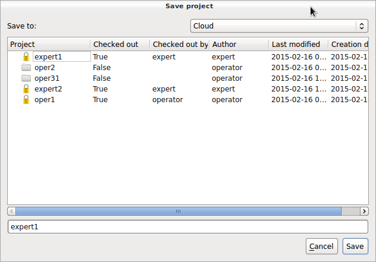
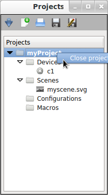
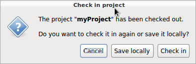

How to use the graphical interface (GUI)
========================================

Project handling
----------------

Creating a new project
~~~~~~~~~~~~~~~~~~~~~~

If you want to create a new project you need to click the button "New project" in the project panel.
The following dialog appears:

You need to choose whether to create the project in the "cloud" or on your local filesystem.
Hint: even if you created the project initially on your local filesystem you can check it into the "cloud" anytime later.

We recommend always using the cloud for saving your projects. This allows accessing your projects from any computer.
Once you created a new project you are the author and the project will be read only for other users. Only after closing and checking it back in, the project will be accessable for other users again.

When the project was edited you need to save the changes before closing it.

Saving projects checked out from the cloud always requires you to specify where to save the changes - either locally or directly in the cloud.

