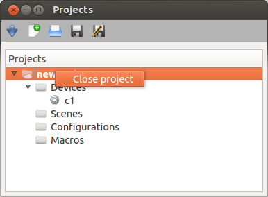

******************************************
 How to use the graphical interface (GUI)
******************************************

This chapter describes how to use Karabo's graphical interface which allows users to interact with devices for testing and debugging purposes. 

Start up the GUI
================

After the Karabo GUI starts up the GUI needs to connect to the server first. This can be accomplished by pressing the "Connect to server"-button (just under the 'Edit'). Then the following Login-window as on the picture below appears:

.. image:: images/gui_login.png

You can log into the system as "observer", "user", "operator", "expert" oder "admin" depending on your expertise. If you want to login in with your KERBEROS username, you need to change the provider from "LOCAL" to "KEBEROS.

Press the "Connect"-button in the Login-window and you will see the life "Navigation" showing all device-servers, plugins and device instances of the system.

.. image:: images/gui_connected.png

All panels of the GUI are dock-able and resizeable. The "Configurator" is an automatically generated, allowing to read and write the properties and to execute the commands of the selected device.

Project handling
================

For persisting device start up configurations, scenes (PowerPoint-like), configurations or macros you should create a project in the project panel.

Creating a new project
----------------------

If you want to create a new project you need to click the button "New project" in the project panel.
The following dialog appears:

.. image:: images/gui_new_project.png

You need to choose whether to create the project in the "cloud" or on your local filesystem.
Hint: even if you created the project initially on your local filesystem you can check it into the "cloud" anytime later.

We recommend always using the cloud for saving your projects. This allows accessing your projects from any computer.
Once you created a new project you are the author and the project will be read only for other users. Only after closing and checking it back in, the project will be accessable for other users again.

When the project was edited you need to save the changes before closing it.

Saving projects checked out from the cloud always requires you to specify where to save the changes - either locally or directly in the cloud.

Handling devices
----------------

If you want to add a device or a device group to your projects you need to click on the right mouse-button on the section "Devices". The context menu appears and you select "Add device/device group". The following dialog appears in which you can set all relevant properties.

.. image:: images/gui_add_device.png

Adding a device group requires to check "Add device group" and the dialog gets enlarged:

.. image:: images/gui_add_devicegroup.png

Handling scenes
---------------

If you want to add a scene to your projects you need to click on the right mouse-button on the section "Scenes". The context menu appears and you select "Add scene" or "Open scene" (which expects SVG files). The following dialog appears in which you can set the name of the scene or select the file which you want to open.

.. image:: images/gui_add_scene.png

Handling configurations
-----------------------

Handling macros
---------------

If you want to add a macro to your projects you need to click on the right mouse-button on the section "Macros". The context menu appears and you select "Add macro" or "Load macro". The following dialog appears in which you can set the name of the macro.

.. image:: images/gui_add_macro.png

Handling monitors
-----------------

If you want to add a monitor to your projects you need to click on the right mouse-button on the section "Monitors". The context menu appears and you select "Add monitor". The following dialog appears in which you can set all relevant properties.

If there are monitors in a project a "Filename..." and an "Interval..." can be set via the context menu. Once these these parameters are applied monitors can be started by selecting "Start monitoring" in the context menu of the section "Monitors". If you want to "Stop monitoring" this can be done using the context menu, too.

