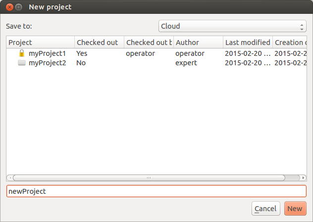

.. _howto-gui:

******************************************
 How to use the graphical interface (GUI)
******************************************

This chapter describes how to use Karabo's graphical interface which allows 
users to interact with devices for testing and debugging purposes. 

Start up the GUI
================

After the Karabo GUI starts up, it needs to connect to the server first. This 
can be accomplished by pressing the "Connect to server"-button (just under the 
'Help'). Then the following Login-window as on the picture below appears:

You can log into the system as "observer", "user", "operator", "expert" oder 
"admin" depending on your expertise. If you want to login in with your KERBEROS
username, you need to change the provider from "LOCAL" to "KEBEROS.

The login only works if :ref:`Starting up Karabo <run-startup>` was done
properly, which means that there is a GuiServer running on the host the GUI wants
to connect to.

Press the "Connect"-button in the Login-window and you will see the life 
"Navigation" showing all device-servers, plugins and device instances of the 
system.

All panels of the GUI are dock-able and resizeable. The "Configurator" is an 
automatically generated, allowing to read and write the properties and to 
execute the commands of the selected device.

Project handling
================

For persisting device start up configurations, scenes (PowerPoint-like), 
configurations or :ref:`macros <howto-macro>` you should create a project in the
project panel.

Creating a new project
----------------------

If you want to create a new project you need to click the button "New project" 
in the project panel.

The following dialog appears:

You need to choose whether to create the project in the "cloud" or on your local 
filesystem. 

Hint: even if you created the project initially on your local filesystem you can 
check it into the "cloud" anytime later.

We recommend always using the cloud for saving projects. This allows accessing 
your projects from any computer. Once you created a new project you are the 
author and the project will be read only for other users. Only after closing and
checking it back in, the project will be accessable for other users again.

.. image:: images/gui_close_project.png

When the project was edited you need to save the changes before closing it.

.. image:: images/gui_save_project.png

Saving projects checked out from the cloud always requires you to specify where
to save the changes - either locally or directly in the cloud.

Handling devices
----------------

If you want to add a device or a device group to your projects you need to click
on the right mouse-button on the section "Devices". The context menu appears and
you select "Add device/device group". The following dialog appears in which you
can set all relevant properties.

.. image:: images/gui_add_device.png

Adding a device group requires to check "Add device group" and the dialog gets
enlarged:

Handling scenes
---------------

If you want to add a scene to your project you need to click on the right
mouse-button on the section "Scenes". The context menu appears and you select
"Add scene" or "Open scene" (which expects SVG files). The following dialog 
appears in which you can set the name of the scene or select the file which you
want to open.

Scenes can be saved in a project but there is also the option to export them as
a SVG file by right-clicking on the scene item and selecting "Save as".

Furthermore the context menu for a scene also allows changing the name ("Edit
scene"), duplicating and deleting the selected scene.

Populating scenes
+++++++++++++++++

A scene has two different modes: a design and the control mode.
The design mode allows the user to populate and change the scenes.

 +-----------------------------------------+------------------------------------------+
 | .. figure:: images/gui_scene_design.png | .. figure:: images/gui_scene_control.png |
 |    :scale: 50%                          |    :scale: 50%                           |
 |                                         |                                          |
 |    Scene in design mode.                |    Scene in control mode.                |
 |                                         |                                          |
 +-----------------------------------------+------------------------------------------+

Scenes can be populated with two different flavors of widgets:
 - static widgets like text, lines and rectangles
 - dynamic widgets which refer to a device property and have a custom display
   depending on the data type

The static widgets can be created from the scene's toolbar.

By dragging and dropping items from the configurator panel into the scene device
properties can be put into a scene. Once this is done a default widget is used
which can be changed via the context menu of the widget.

To create new customizable widgets for the scenes look :ref:`here <howto-widget>`.

Plots
+++++

There are different kind of plots available in the GUI:

 - Trendline (numerical values over time)
 - Plot (numerical vector)
 - XY-Plot (certain number of numerical vectors of same length)

The features of plots are available in the "control mode" of the scene.
Changing parameters of a curve is possible by selecting the curve at first and
then use the context menu by right-clicking the mouse. The first entry
"Parameters" allows e.g. changing the color of the curve. This is needed to
distinguish between the different curves of a plot.

.. figure:: images/gui_plot_parameters.png
 :align: center
 
 The dialog to change different parameters of a plot.

By clicking the middle mouse button the curves get fit into the plot widget.

Axis scaling can be realized by holding the right mouse button and moving it:
 - move left/right - change x axis scaling
 - move up/down - change y axis scaling)

Another way to change the axis scaling is to double-click the left mouse button
on the axis which should be scaled. Depending on the type of the axis the
following dialog will appear.

 +---------------------------------------------------+-------------------------------------------------+
 | .. figure:: images/gui_plot_axis_scale_normal.png | .. figure:: images/gui_plot_axis_scale_time.png |
 |                                                   |                                                 |
 |    Axis scaling using Min and Max value.          |    Axis scaling over time.                      |
 |                                                   |                                                 |
 +---------------------------------------------------+-------------------------------------------------+

Handling configurations
-----------------------

Device configurations can be saved via the configuration panels toolbar.
There are two options available:
 - Save configuration to file (*.xml)
 - Save configuration to project

If a configuration is saved to a project it appears in the "Configuration"
section of the project using the name which was given by the user.

Correspondingly, a device configuration can be loaded too:
 - Open configuration from file (*.xml)
 - Open configuration from project

Handling macros
---------------

If you want to add a macro to your projects you need to click on the right
mouse-button on the section "Macros". The context menu appears and you select
"Add macro" or "Load macro". The following dialog appears in which you can set
the name of the macro.

More information on how to actually write a macro can be found :ref:`here
<howto-macro>`.

Handling monitors
-----------------

If you want to add a monitor to your projects you need to click on the right
mouse-button on the section "Monitors". The context menu appears and you select
"Add monitor". The following dialog appears in which you can set all relevant
properties.

.. image:: images/gui_add_monitor.png

If there are monitors in a project a "Filename..." and an "Interval..." can be
set via the context menu. Once these these parameters are applied monitors can
be started by selecting "Start monitoring" in the context menu of the section
"Monitors". If you want to "Stop monitoring" this can be done using the context
menu, too.

