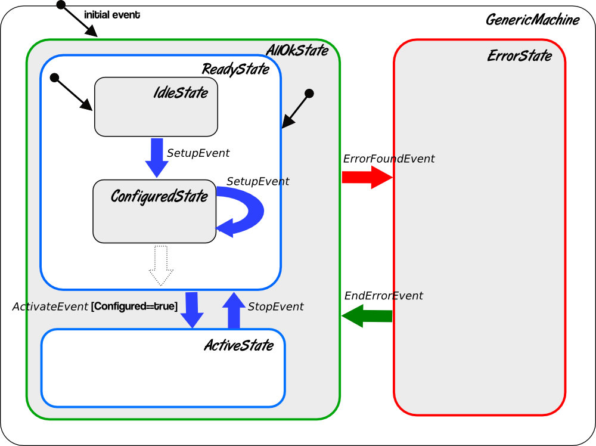
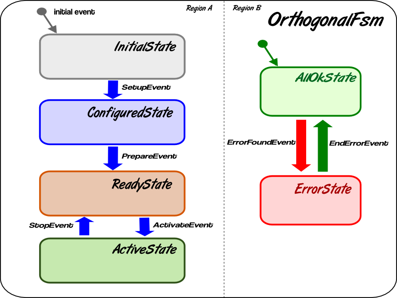

.. _stateMachines:

*************************
Final State Machine (FSM)
*************************

State Machine or Finite State Machine (FSM) is a technology used for
modeling and designing real life systems. Most non-trivial, real
systems evolve and pass during their lifetime through the several
distinct stages (states). The behavior of the system may depend on
these states. The system may change its state due to external and/or
internal events. What exactly these states mean, how many states such
a system may have, which events are involved into driving the system
to another state, what's happened during transition between states, it
is defined by a model as an approximation to the real system. The tool
helping to build such a model is Finite State Machine.

Overview
========

FSM engine
----------

There are many implementations of FSM out there. The Karabo framework
uses  implementation found in Boost C++ template library: Meta State
Machine (MSM).  This choice was recognized to be attractive due to the
following reasons...

* It is a part of the Boost library and, therefore, an open source.
  MSM belongs to the class of UML (Unified Modeling Language) state
  machines with full UML support (nested state machines, orthogonal
  regions, anonymous and internal transitions etc.)
* Good documentation.
* MSM proposes well readable and terse interface for State Transition
  Diagram (STD) definitions. Easy to use. Conversion from UML diagram
  to STD is straightforward.
* MSM has front-end/back-end architecture and provides several
  front-ends for STD definitions.
* MSM uses template metaprogramming technique and we do not need any
  special precompiler or tool but just plain C++ compiler. Most of the
  problems can be discovered during compile time.
* This is the fastest FSM engine we have found.

As a disadvantage we should mention a few...

* Sometimes you may have limitations on a number of states handled.
* The compilation time may increase significantly depending on
  complexity of STD and chosen front-end.
* This is quite a new technology

State machine glossary
----------------------

It is highly recommended to read MSM User's guide, at least, UML Short
Guide and Tutorial. Here, for your convenience, we want to cite the
glossary that can be found in MSM documentation:

**state machine** The life cycle of a thing. It is made of finite
number of states, nested submachines, regions, transitions and
processes incoming events. It may have entry and exit behaviors.

**FSM** An abbreviation of **F**\ inite **S**\ tate **M**\ achine

**STD** A **S**\ tate **T**\ ransition **D**\ iagram, a description of
FSM in graphical form with states as round rectangles and transitions
as arrows.  This can be illustrated with the example on :ref:`Figure 1
<genericFsm>`

.. _genericFsm:

   **Figure 1.** Example of generic State Transition Diagram.

**state** A stage in the life cycle of a state machine. A state can
have an entry and exit behaviors.

**event** An incident provoking (or not) a reaction of the state
machine

**transition** A specification of how a state machine reacts to an
event.  It specifies a source state, the event triggering the
transition, the target state (which will become the newly active state
if the transition is triggered), guard and actions.

**action** An operation executed during the triggering of the
transition. The action may be an entry, exit or transition action

**guard** A boolean operation being able to prevent the triggering of
a transition which would otherwise fire.

**transition table** Representation of a state machine. A STD is a
graphical and, sometimes, incomplete representation of the same model.
A transition table, on the other hand, is a complete representation in
some table form.

**initial state** The state in which the state machine (or submachine)
starts. Having several orthogonal regions means having as many initial
states.

**submachine** A submachine is a state machine inserted as a state in
another state machine and can be found several times in a same state
machine.

**orthogonal** regions (logical) parallel flow of execution of a state
machine. Every region of a state machine gets a chance to process an
incoming event. Graphically represented as a round rectangle separated
by dashed lines. It is needed when a status of a system during its
life cycle has to be described not just by one parameter like state
name, but more than one.  See :ref:`Figure 2 <orthogonalFsm>` as an
example of STD with regions.

.. _orthogonalFsm:

   **Figure 2.** STD with orthogonal regions.

**terminate pseudo-state** When this state becomes active, it
terminates the execution of the whole state machine. MSM does not
destroy the state machine as required by the UML standard, however,
which lets you keep all the state machine's data.

**entry/exit pseudo state** defined for submachines and are defined as
a connection between a transition outside of the submachine and a
transition inside the submachine.  It is a way to enter or leave a
submachine through a predefined point.

**fork** A fork allows explicit entry into several orthogonal regions
of a submachine.

**history** A history is a way to remember the active state of a
submachine so that the submachine can proceed in its last active state
next time it becomes active.

**completion events (also called completion/anonymous transitions)**
When a transition has no named event triggering it, it automatically
fires when the source state is active, unless a guard forbids it.

**transition conflict** A conflict is present if for a given source
state and incoming event, several transitions are possible.  UML
specifies that guard conditions have to solve the conflict.

**internal transitions** transition from a state to itself without
having exit and entry actions being called.  Instead a transition
action is called.

Now return back to the :ref:`Figure 1 <genericFsm>`.  This is an
example of nested state machines: the top state machine GenericMachine
contains 2 states: AllOkState and ErrorState.  The AllOkState is not
just a simple state but a submachine and contains 2 states: ReadyState
and ActiveState.  The ReadyState is a submachine as well and contains
2 states: IdleState and ConfiguredState.  Remember that every state
machine has to be instructed, which state is an initial state.  This
is represented by an arrow with origin of a small circle.  It means
that AllOkState is an initial state of GenericMachine, where is
ReadyState is initial state of AllOkState, and IdleState is initial
state of ReadyState. So it also means that after starting
GenericMachine the first stage will be IdleState and the following
actions will be called: entry code for GenericMachine, entry code for
AllOkState, entry code for ReadyState and entry code for IdleState.

The GenericMachine is driven by the following events:

* *SetupEvent* tells the system that it should setup itself and change
  the IdleState to ConfiguredState, or ConfiguredState to
  ConfiguredState. If the system is in ActiveState the SetupEvent will
  be ignored.
* *ActivateEvent* tells the system to go to the
  ActiveState. Optionally, the guard boolean condition goes after
  event name, in square brackets.  It tells that the transition to the
  ActiveState is happened only if the current state nested into
  ReadyState is the ConfiguredState.
* *StopEvent* returns the system to ReadyState and, therefore, to
  IdleState (initial state).
* *ErrorFoundEvent* transfers state machine into ErrorState
  independent of what is the current state nested into AllOkState.
* *EndErrorEvent* returns a state machine to the AllOkState, then to
  the ReadyState and then it moves to the IdleState, as if a state
  machine has just started!

Another strategy of recovering from ErrorState is shown on
:ref:`Figure 2 <orthogonalFsm>`.

:ref:`Figure 2 <orthogonalFsm>` demonstrates two orthogonal regions
that are running in parallel, so the status of a state machine is
defined by 2 parameters: by state in **region A** and by state in
**region B**.  When the OrthogonalFsm state machine starts, it moves
to InitialState inregion A and to AllOkState in region B. Then
subsequent events drive the state machine to next state in both
regions in parallel. In our case, the events that drive machine in
region A do not influence the status in region B.  We expect that if
ErrorFoundEvent is processed by state machine and the system moves to
ErrorState in region B, we should not continue normal processing in
region A. It is not represented graphically in :ref:`Figure 2
<orthogonalFsm>`, but ErrorState is some sort of special state.  It
can be declared as *terminate state* or *interrupt state*.

The *terminate state* results in termination of state machine. 

The *interrupt state* results in blocking all events except
EndErrorEvent.  This is useful if you want to model an error recovery
of a real system.  After recovery from errors the functionality in
region A will be restored as it was before ErrorFoundEvent.  Now we
discuss how to use MSM for implementing these State Transition
Diagrams.

FSM Model
=========

Boost MSM library proposes three front-ends for STD definitions:
basic, functor and eUML front-end. It was agreed to use a mixture of
basic and functor front-ends designing some macros that allow the code
looking more readable.  To build a state machine we have to operate
with the following objects: **events, actions, guards, states, state
transition tables** and **state machines**.

Follow this order at state machine's definition. Also be aware that
all these objects are C++ types (classes), not the instances of
classes! One of possible designs of integrating FSM is to define all
the types (events, actions, ...)in our "context" class as nested
classes. It was agreed that all our STD's should have error handling
based on state machine, namely, every state machine should have the
special error state. This resulted in designing macros that are error
handling aware.

It was decided as well that we have to separate FSM definitions from
"business logic".  It allows to reuse the same FSM definitions with
other "business logic" implementations.  To cope with that context
class just declare interfaces which have to be implemented in a class
that inherits from context. Below we discuss the macros for every data
structure.

Events
------

Define events that drive a state machine using the following macro
definitions:

.. code-block:: c++

  KARABO_FSM_EVENTn(pointerToFSM, EventClass, slotEventFunction [ , argType1 ,...])

| where n = 0..4 is the number of arguments in payload of event and
| pointerToFSM is a pointer to the state machine class;
| EventClass is the structure like struct Event {...}; generated by a macro;
| slotEventFunction is an event processing member function with n arguments of
  types argType1, ... .

**Example.**

.. code-block:: c++

  class UsersTestFsm : public karabo::core::BaseFsm {

  public :
      KARABO_FSM_EVENT0(m_fsm, ActivateEvent, slotActivateEvent)
      KARABO_FSM_EVENT1(m_fsm, SetupEvent, slotSetupEvent, karabo::util::Hash)
      KARABO_FSM_EVENT2(m_fsm, ErrorFoundEvent, errorFound, std::string, std::string)

      // ...

  private:
    KARABO_FSM_DECLARE_MACHINE(MyFsm, m_fsm);

  };

Actions
-------

A transition action is a functor, i.e. a class that implements void
operator()(...). An action may be defined with a help of the following
macros:

.. code-block:: c++

  KARABO_FSM_V_ACTIONn(ActionClass, actionFunction, argType1,...)
  KARABO_FSM_VE_ACTIONn(ActionClass, actionFunction, argType1,...)
  KARABO_FSM_PV_ACTIONn(ActionClass, actionFunction, argType1,...)

| where n = 0..4 is the number of arguments corresponding to the payload 
  of the event that initiates a transition and
| ActionClass is the name of generated functor;
| actionFunction is a virtual (V), virtual empty (VE), or pure virtual (PV) 
  member function with n arguments of types: argType1,...

**Example.**

.. code-block:: c++

  class Abc : public karabo::core::BaseFsm
  {

  public :
      // ...

      KARABO_FSM_PV_ACTION1(          
          ConfigureAction, // transition action class (functor)
          configureAction,  // transition action function
          karabo::util::Hash) // type of arg1

      KARABO_FSM_PV_ACTION0(StopAction, stopAction)

      // ...

  private:
      KARABO_FSM_DECLARE_MACHINE(MyFsm, m_fsm);
  };

Note that class Abc is an abstract class.

Guards
------

The guard is a functor, i.e. a class that implements bool operator()(...). 

The guard may be defined with a help of the following macros:

.. code-block:: c++

  KARABO_FSM_V_GUARDn(GuardClass, guardFunction, argType1,...)
  KARABO_FSM_VE_GUARDn(GuardClass, guardFunction, argType1,...)
  KARABO_FSM_PV_GUARDn(GuardClass, guardFunction, argType1,...)

| where n = 0..4 is the number of arguments corresponding to the payload of 
  the event that initiates a transition and
| GuardClass is the name of generated functor;
| guardFunction is a virtual (V), virtual empty (VE), or 
  pure virtual (PV) member function with n arguments of types: argType1,...

**Example.**

.. code-block:: c++

  class UsersTestFsm : public karabo::core::BaseFsm {

  public :  

      //...  

      KARABO_FSM_V_GUARD1(
          ConfigureGuard, // guard class ( functor )
          configureGuard, // guard function
          karabo::util::Hash)  // type of arg1

      KARABO_FSM_V_GUARD0(StopGuard, stopGuard)

      // ...

  private:
      KARABO_FSM_DECLARE_MACHINE(MyFsm, m_fsm);
  };

| Note that member functions:
| virtual bool configureGuard(karabo::util::Hash const& config);
| virtual bool stopGuard();
| have to be implemented in .cc file.

States
------

To define a simple state, use one of the following macros

* without entry or exit behaviours:

  KARABO_FSM_STATE(StateClass)

* with entry behaviour only ("virtual" , "virtual empty" or 
  "pure virtual" onEntryFunction):

  | KARABO_FSM_STATE_V_E(StateClass, onEntryFunction)
  | KARABO_FSM_STATE_VE_E(StateClass, onEntryFunction)
  | KARABO_FSM_STATE_PV_E(StateClass, onEntryFunction)

  | KARABO_FSM_STATE_V_En(StateClass, onEntryFunction, argType1, ...)
  | KARABO_FSM_STATE_VE_En(StateClass, onEntryFunction, argType1, ...)
  | KARABO_FSM_STATE_PV_En(StateClass, onEntryFunction, argType1, ...)

  where n = 1..4  is the number of arguments to onEntryFunction.

* with entry and exit behaviours ("virtual", "virtual empty" or "pure
  virtual" onEntryFunction and onExitFunction)

  | KARABO_FSM_STATE_V_EE(StateClass, onEntryFunction, onExitFunction)
  | KARABO_FSM_STATE_VE_EE(StateClass, onEntryFunction, onExitFunction)
  | KARABO_FSM_STATE_PV_EE(StateClass, onEntryFunction, onExitFunction)

To define *terminate* state, use one of the following macros:

* without entry/exit behaviours

  KARABO_FSM_TERMINATE_STATE(StateClass)

* with entry behaviour only ("virtual", "virtual empty" or "pure virtual")

  | KARABO_FSM_TERMINATE_STATE_V_E(StateClass, onEntryFunct)
  | KARABO_FSM_TERMINATE_STATE_VE_E(StateClass, onEntryFunct)
  | KARABO_FSM_TERMINATE_STATE_PV_E(StateClass, onEntryFunct)

* with entry and exit behaviours ("virtual", "virtual empty" or "pure
  virtual")

  | KARABO_FSM_TERMINATE_STATE_V_EE(StateClass, onEntryFunct, onExitFunct )
  | KARABO_FSM_TERMINATE_STATE_VE_EE(StateClass, onEntryFunct,onExitFunct)
  | KARABO_FSM_TERMINATE_STATE_PV_EE(StateClass, onEntryFunct,  onExitFunct)
 
To define *interrupt* state, use one of the following macros:

* without entry/exit behaviours

  KARABO_FSM_INTERRUPT_STATE(StateClass)

* with entry behaviour only ("virtual", "virtual empty" or "pure virtual")

  | KARABO_FSM_INTERRUPT_STATE_V_E(StateClass, onEntryFunction)
  | KARABO_FSM_INTERRUPT_STATE_VE_E(StateClass, onEntryFunction)
  | KARABO_FSM_INTERRUPT_STATE_PV_E(StateClass, onEntryFunction)

* with entry and exit behaviours ("virtual", "virtual empty" or "pure
  virtual")

  | KARABO_FSM_INTERRUPT_STATE_V_EE(StateClass, onEntryFunction,
    onExitFunction )
  | KARABO_FSM_INTERRUPT_STATE_VE_EE(StateClass, onEntryFunction,
    onExitFunction)
  | KARABO_FSM_INTERRUPT_STATE_PV_EE(StateClass, onEntryFunction,
    onExitFunction)

To define *pseudoexit* state, use one of the following macros:

* without entry/exit behaviours

  KARABO_FSM_EXIT_PSEUDO_STATE(StateClass, event)

* with entry behaviour only ("virtual", "virtual empty" or "pure
  virtual")

  | KARABO_FSM_EXIT_PSEUDO_STATE_V_E(StateClass, event, onEntryFunction)
  | KARABO_FSM_EXIT_PSEUDO_STATE_VE_E(StateClass, event, onEntryFunction)
  | KARABO_FSM_EXIT_PSEUDO_STATE_PV_E(StateClass, event, onEntryFunction)

* with entry and exit behaviours ("virtual", "virtual empty" or "pure virtual")

  | KARABO_FSM_EXIT_PSEUDO_STATE_V_EE(StateClass, event, onEntryFunction,
    onExitFunction)
  | KARABO_FSM_EXIT_PSEUDO_STATE_VE_EE(StateClass, event, onEntryFunction, 
    onExitFunction)
  | KARABO_FSM_EXIT_PSEUDO_STATE_PV_EE(StateClass, event, onEntryFunction, 
    onExitFunction)

**Example.**

.. code-block:: c++

  class UsersTestFsm : public karabo::core::BaseFsm {

  public :

      // ...

      KARABO_FSM_STATE_PV_EE (
          IdleState,    //state
          idleStateOnEntry,  // pure virtual entry
          idleStateOnExit )  // pure virtual exit

      KARABO_FSM_INTERRUPT_STATE_PV_EE (
        ErrorState,   // state
        errorStateOnEntry, // pure virtual entry
        errorStateOnExit ) // pure virtual exit

      // ...

  private:
      KARABO_FSM_DECLARE_MACHINE(MyFsm, m_fsm);
  };

State Transition Table
----------------------

A State Transition Table (STT) for functor front-end is a vector of
rows and each row is a vector of elements such as **source state,
target state, event, transition action** and **guard**.  All these
elements are C++ types and the order of operation is the following: if
state machine is in the **source state** and event is entered, the
state machine checks the **guard** first and if it returns boolean
"true", the state machine exits from **source state** (exit action),
then executes **transition action** and enters the **target state**
(entry action).  Because of STT has to operate with types, we cannot
work with vectors from Standard Template Library (std::vector), but
use the vectors from Boost MPL library that operates with vector of
types at compile time! As a result, STT with exactly one row may look
like

.. code-block:: c++

  namespace mpl = boost::mpl;

  // ...

  struct MySTT : mpl::vector<Row<SourceState, ExternalEvent, TargetState, TransitionAction, MyGuard>>{};

  // ...

If you want to omit some element in the row, use **none**.

Use macros to define your STT, as shown in the following C++ example:

.. code-block:: c++

  KARABO_FSM_TABLE_BEGIN(TopStt)
  //   Source-State          Event             Target-State   Action            Guard      
  Row< InitializationState,  none,             AllOkState,    none,             none >,
  Row< AllOkState,           ErrorFoundEvent,  ErrorState,    ErrorFoundAction, none >,
  Row< ErrorState,           EndErrorEvent,    AllOkState,    none,             none >
  KARABO_FSM_TABLE_END

The STT should describe all designed transitions and is the core of a
state machine where the logic of its behavior is concentrated in one
place, in terse form. Now it seems to be obvious creating STT from
graphical STD, almost one-to-one translation.

State Machine
-------------

To define a state machine we have to define all other elements that
belong to a state machine: events, actions, guards, states and state
transition table.  The machine without entry/exit behaviors may be
defined like

.. code-block:: c++

  KARABO_FSM_STATE_MACHINE(StateMachineName, Stt, InitialState,  Context)

where

* StateMachineName is a class generated in macro;
* Stt is a State Transition Table which is a class;
* InitialState is a state that (sub)machine enters when it starts;
* Context is a container class with state machine definitions.

We provide as well macros with entry/exit behaviors:

.. code-block:: c++

  KARABO_FSM_STATE_MACHINE_V_E(StateMachineName, Stt, InitialState, Context, onEntryFunc)
  KARABO_FSM_STATE_MACHINE_VE_E(StateMachineName, Stt, InitialState, Context, onEntryFunc)
  KARABO_FSM_STATE_MACHINE_PV_E(StateMachineName, Stt, InitialState, Context, onEntryFunc)
  KARABO_FSM_STATE_MACHINE_V_EE(StateMachineName, Stt, InitialState, Context, onEntryFunc, onExitFunc)
  KARABO_FSM_STATE_MACHINE_VE_E(StateMachineName, Stt, InitialState, Context, onEntryFunc, onExitFunc)
  KARABO_FSM_STATE_MACHINE_PV_EE(StateMachineName, Stt, InitialState, Context, onEntryFunc, onExitFunc)

**Example.**

.. code-block:: c++

  class UsersTestFsm : public karabo::core::BaseFsm {

  public :

    // ...

    KARABO_FSM_STATE_MACHINE (
         MyFsm ,    // state machine class
         MySTT ,    // transition table class
         IdleState , // initial state class
         Self )  // context class

    //...

  private:
      KARABO_FSM_DECLARE_MACHINE(MyFsm, m_fsm);
  };

Setting up a Context
--------------------

To access the context from a state machine’s actions we have to set
the context up first. In case of nested state machines it should be
done for all submachines in hierarchy. It is possible to accomplish
after state machine instance’s creation and before it is started
because the whole hierarchy of instances of submachines and states is
created as well. For setting a context up, use the following macros

.. code-block:: c++

  KARABO_FSM_SET_CONTEXT_TOP(context, topMachnePointer)
  KARABO_FSM_SET_CONTEXT_SUB(context, parent, SubFsm)   // or :
  KARABO_FSM_SET_CONTEXT_SUB1(context, parent, SubFsm)
  KARABO_FSM_SET_CONTEXT_SUB2(context, fsmInstance, SubFsm1, SubFsm2)
  KARABO_FSM_SET_CONTEXT_SUB3(context, fsmInstance, SubFsm1, SubFsm2, SubFsm3)

**Example.**

.. code-block:: c++

  class UsersTestFsm : public karabo::core::BaseFsm {
  
  public :
  
    // ...

    void startFsm(){
      //create instance of top machine
      KARABO_FSM_CREATE_MACHINE(MyFsm, m_fsm);

      //set context into top machine
      KARABO_FSM_SET_CONTEXT_TOP(this, m_fsm)

      // set context in top-down order
      KARABO_FSM_SET_CONTEXT_SUB(this, m_fsm, MySub)
      KARABO_FSM_SET_CONTEXT_SUB2(this, m_fsm, MySub, MySubSub)        

      // now start top_machine
      KARABO_FSM_START_MACHINE(m_fsm)
    }

    // ...

  private: //members
     KARABO_FSM_DECLARE_MACHINE(MyFsm, m_fsm);
  };

