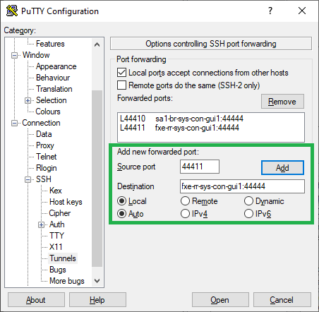

..
  Copyright (C) European XFEL GmbH Schenefeld. All rights reserved.

*************************************
Connecting with Karabo GUI on Windows
*************************************
Installation and running KaraboGUI via ``conda`` on Windows requires additional tools and configuration. This is especially
when working on a non-DESY network.

For connections to the DESY network and exflgateway, it is recommended to use **PuTTy**, a free SSH (and telnet) client.
This can be downloaded from `here <https://www.chiark.greenend.org.uk/~sgtatham/putty/latest.html>`_

Installing Outside of DESY Network
==================================

Setting up SSH Connection using PuTTy
-------------------------------------

Since the installation process accesses ``http://exflctrl01.desy.de``, which is only accessible
inside DESY network, there is a need to configure an SSH tunnel to Bastion.

1. In ``Sessions``, configure the destination hostname/port as such:

    - Hostname = ``bastion.desy.de``
    - Port = ``22``
    - Connection type: SSH

   Using Putty to tunnel to Bastion.

2. In ``Connections >> SSH >> Tunnels``, add the following:

    - Source port: ``8888`` (or any unused port number)
    - Destination: ``bastion.desy.de``, ``Dynamic``, ``Auto``

    This enables the local machine to connect to Bastion via a proxy, at ``localhost:8888``.
    This, in turn, will also enable the ``conda`` installation with a proper configured conda environment.

   Enabling Bastion proxy at ``localhost:8888``

3. Press **Open** to start the connection, and enter your credentials in the displayed terminal.

   Accessing Bastion

.. _`conda channel configuration`: https://in.xfel.eu/readthedocs/docs/karabo/en/latest/installation/gui.html#installing-conda
.. _`installation`: https://in.xfel.eu/readthedocs/docs/karabo/en/latest/installation/gui.html

Additional Conda Configuration
------------------------------

In addition to the the `conda channel configuration`_, the proxy that ``conda`` will use to connect to DESY network
must be configured as well. This is by adding the following:

    conda config --set proxy_servers.http socks5://localhost:8888

where the port number (e.g., `8888`) is the entered number from the PuTTy tunnel configuration.

Then one can proceed with the normal `installation`_.

Connecting to GUI servers
=========================

Connection to GUI servers is done via SSH. PuTTy can be used to manage these connections.

Inside of DESY Network
----------------------

1. In ``Sessions``, configure the destination hostname/port as such:

    - Hostname = ``exflgateway``
    - Port = ``22``
    - Connection type: SSH

   Using Putty to tunnel to ``exflgateway``.

2. In ``Connections >> SSH >> Tunnels``, one can add the details for the GUI servers. For instance,
configure the forwarded ports as such:

    - Source port: ``44411`` (or any unused port number)
    - Destination: ``fxe-rr-sys-con-gui1:44444``, ``Local``, ``Auto``

    This enables the KaraboGUI to connect to **FXE** with the port ``44411``

   Enabling ``exflgateway`` tunnel at ``localhost:44400``

3. Press **Open** to start the connection, and enter your credentials in the displayed terminal.

   Accessing ``exflgateway``

The KaraboGUI can then connect to **FXE** with the following details:

.. figure:: images/windows/connect-dialog.png
   :align: center
   :alt: Connecting to FXE with KaraboGUI
   :figclass: align-center

   Connecting to **FXE** with KaraboGUI

Outside of DESY Network
-----------------------

The PuTTy configuration when working outside DESY network is very similar with the previous configurations,
but two PuTTy sessions are now needed to successfully tunnel through the desired GUI server. This is by
running two sessions/applications.

**I. First PuTTy session: Connecting to Bastion**

1. In ``Sessions``, configure the destination hostname/port as such:

    - Hostname = ``bastion.desy.de``
    - Port = ``22``
    - Connection type: SSH

   Using Putty to tunnel to bastion.

2. In ``Connections >> SSH >> Tunnels``, add the following:

    - Source port: ``44400`` (or any unused port number)
    - Destination: ``exflgateway:22``, ``Local``, ``Auto``

    This enables the local machine to tunnel to ``exflgateway``. This will be used when tunnelling to
    the GUI servers.

   Enabling ``exflgateway`` tunnel at ``localhost:44400``

3. Press **Open** to start the connection, and enter your credentials in the displayed terminal.

**II. Second PuTTy session: Tunneling to exflgateway**

The process is very similar with [configuration inside DESY network](#inside-of-desy-network), but instead, the
hostname/port to use is the supplied port number for the ``exflgateway`` in the first session

In ``Sessions`` of a new PuTTy application, configure the destination:

    - Hostname = ``localhost``
    - Port = ``44400``
    - Connection type: SSH

