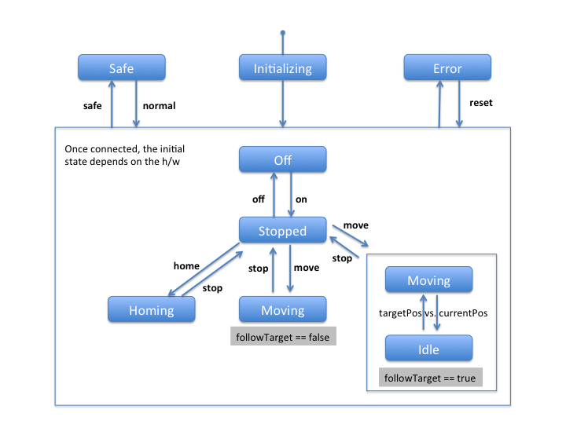

***********
Interfaces
***********

Motor Interface
===============

The motor interface fixes the basic commands and properties available for any device that is driving a physical motor.

CAVEAT: This interface definition is in its early stages and is likely to change slightly in future.

States
------

The following (device-)states are available:

* Safe
* Error
* Initializing
* Off
* Stopped
* Idle
* Moving
* Homing

Commands
--------

The following commands are available:

+------------+----------------+-----------+
| Command    | Allowed States | Access    |
+============+================+===========+
| on         | Off            | Operator  |
+------------+----------------+-----------+
| off        | On             | Operator  |
+------------+----------------+-----------+
| stop       | Moving, Homing | Operator  |
+------------+----------------+-----------+
| home       | Stopped, Idle  | Operator  |
+------------+----------------+-----------+
| move       | Stopped, Idle  | Operator  |
+------------+----------------+-----------+
| stepUp     | Stopped, Idle  | Operator  |
+------------+----------------+-----------+
| stepDown   | Stopped, Idle  | Operator  |
+------------+----------------+-----------+
| safe       | Any            | Operator  |
+------------+----------------+-----------+
| normal     | safe           | Expert    |
+------------+----------------+-----------+

The state diagram below summarizes states, commands and their transitions:

General Properties
------------------

**Current Position**

NOTE: In the current beckhoffMotor this property is called *encoderPosition*

Always shows the current absolute position in the physical unit: millimeters or milli-radian.

* Key: currentPosition
* Type: double
* Access Mode: read-only	      

**Target Position**

Sets an absolute target position in the physical unit: millimeters or
milli-radian. The behavior of the motor after setting this property
depends on the value of the boolean property *followTarget*. If false,
the target position will only be loaded to the controller, but the
motor won't move until the command *move* is triggered. 

If the motor is in *Idle* state, the motor will immediately move to the applied
target position. **NOTE**: This is an exception to the usual design in Karabo, in which property changes typically don't result in state changes!

* Key: targetPosition
* Type: double
* Access Mode: reconfigurable
* Allowed States: Stopped, Off, Idle, Moving

**Follow Target**

A boolean flag that decides how the motor should react with respect to
the currently loaded target position.
 
If followTarget is set to true, the next move command will bring the
motor into a closed loop such that it always corrects it's position
(respecting a defined *dead band*) to match the target position's
value. The states will be *Moving* when the motor moves and *Idle*
once the motor is on target. 

If followTarget is set to false, the motor will not stay in a closed
loop once the targetPosition is reached, but will fall back to
*Stopped* state once the motor is on target.

* Key: followTarget
* Type: bool
* Access Mode: reconfigurable
* Allowed States: Stopped

**isHardLimitUpper**

Boolean value indicating whether the motor is in the upper limit switch.

* Key: isHardLimitUpper
* Type: bool
* Access Mode: read-only

**isHardLimitLower**

Boolean value indicating whether the motor is in the lower limit switch.

* Key: isHardLimitLower
* Type: bool
* Access Mode: read-only

**isHardLimitHome**

Boolean value indicating whether the motor is in the home switch.

* Key: isHardLimitHome
* Type: bool
* Access Mode: read-only

**isSoftLimitUpper**

Boolean value indicating whether the motor reached the soft upper limit (as defined by softLimitUpper).

* Key: isSoftLimitUpper
* Type: bool
* Access Mode: read-only

**isSoftLimitLower**

Boolean value indicating whether the motor reached the soft lower limit (as defined by softLimitLower).

* Key: isSoftLimitLower
* Type: bool
* Access Mode: read-only

**Deadband**

Defines the deviation from the targetPosition in physical units for which the controller still reports to be on target.

* Key: deadband
* Type: float
* Access Mode: reconfigurable (expert)
* Allowed State: Off, Stopped, Idle

**Backlash**

If this attribute is defined to something different than 0, the motor
will always stop the motion coming from the same mechanical
direction. This means that it could be possible to ask the motor to go
a little bit after the desired position and then to return to the
desired position. The attribute value is the number of steps the motor
will pass the desired position if it arrives from the “wrong”
direction. This is a signed value. If the sign is positive, this means
that the authorized direction to stop the motion is the increasing
motor position direction. If the sign is negative, this means that the
authorized direction to stop the motion is the decreasing motor
position direction.

* Key: backlash
* Type: float
* Access Mode: reconfigurable (expert)

**Reset Current Position**

This property acts like a software homing. The value given by this property will be treated as the *currentPosition* for the location the motor is currently in.
The upper and lower soft limits are adapted accordingly.

* Key: resetCurrentPosition
* Type: double
* Access Mode: reconfigurable (expert)
* Allowed State: Off, Stopped, Idle

Beckhoff Specific Properties
----------------------------

**Step Length**

The step length is used in conjuction with the *stepUp* and *stepDown* commands. It describes the relativ length in physical units (millimeter or milli-radian) that the motor is moved.

* Key: stepLength
* Type: float
* Access Mode: reconfigurable
* Allowed States: Off, Stopped, Idle

**Offset**

The offset to be applied in the motor position computation. By default
set to 0. It is typically memorized on the motor hardware. It is changed upon changing the value of *resetCurrentPosition*.

* Key: offset
* Type: double
* Access Mode: reconfigurable (expert)
* Allowed States: Off, Stopped, Idle

**Step Counter Position**

The step counter position describes the motor position calculated from counter steps (instead of encoder values).

* Key: stepCounterPosition
* Type: float
* Access Mode: read-only (expert)

**Gear**

NOTE: This property should in future be renamed to stepsPerUnit.

The gear defines how many (micro-)steps are finally done to move the motor by one physical unit (millimeter, milli-radian or degree). 64 micro-steps are done per step and something like ~200 steps (depends on motor) will result in a full rotation.

* Key: gear
* Type: float
* Access: reconfigurable (expert)
* Allowed States: Off, Stopped 

**Encode Step**

This property describes the factor by which each encoder step should be scaled to correctly map to the physical unit. If no encoder is present the value will represent the length of a microstep (i.e. 1 / gear).

* Key: encodeStep
* Type: float
* Access: reconfigurable (expert) 

**Epsilon**

The epsilon determines the difference in change (in physical units) until a new physical value is posted from the hardware, i.e. updates the value of *currentPosition*.

NOTE: In the current implementation, care must be taken with very small values of epsilon, as this results in sending very many messages.

* Key: epsilon
* Type: float
* Access Mode: reconfigurable (expert)

**Acceleration**

**Deceleration**

**Velocity**

 

