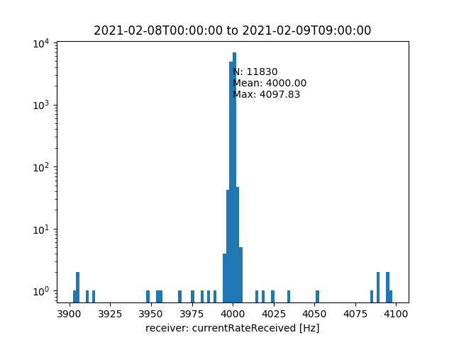
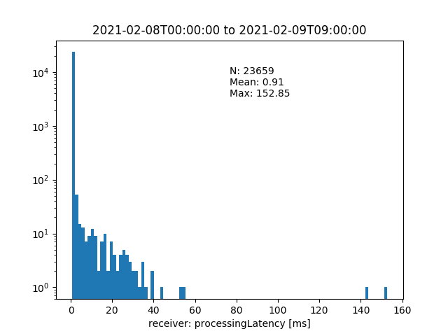

..
  Copyright (C) European XFEL GmbH Schenefeld. All rights reserved.

.. _performances

***************
Performances
***************

Maximum Message Input Rate
===========================

A single device in a C++ device server can receive 4 kHz of small messages
(``Hash`` containing a single ``INT32``) without substantial latencies,
measured as the delays between when a message is sent and when it is received.

The following images show the received message rates (on the left, averaged over
periods of 10 s) and the latencies (on the right, averaged over 5 s) of a test
running for more than 30 hours using Karabo 2.11.0 [#f1]_. Upper images plot
the measured rates and latencies versus time whereas the lower image show
their histograms.

=======   =======
|rate|    |late|
=======   =======
|rateh|   |lateh|
=======   =======

The reduction of very few outliers after about half of the test period is
likely due to a change of the overall system load (network, CPU, ...).

Further tests exhibit that rates up to 10 kHz do not cause problems when
reached for several minutes. 
If the high rate continues, the message receival rate drops suddenly
and a backlog of messages on the broker arises.

.. rubric:: Footnotes

.. [#f1] Older releases had a limit slightly above 2 kHz.
