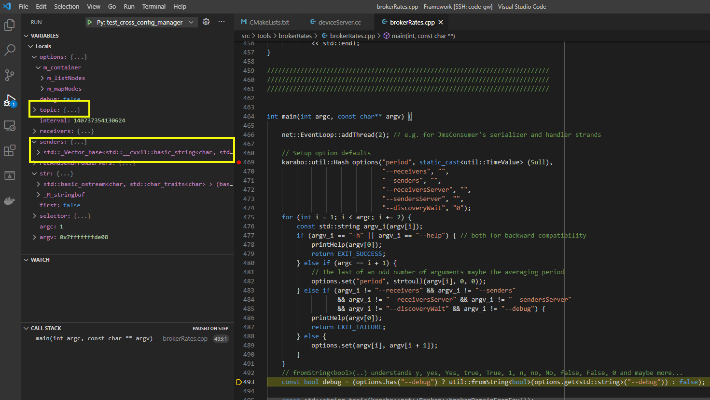
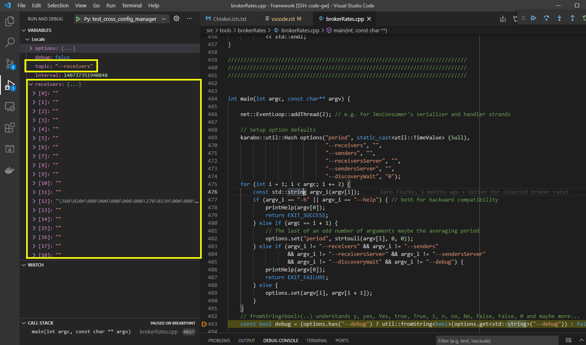
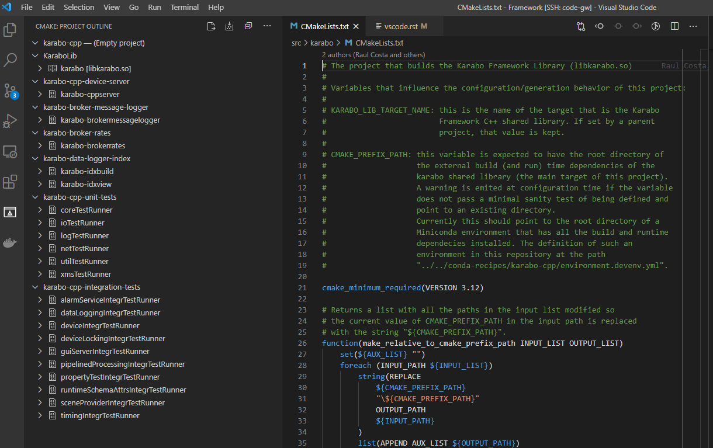
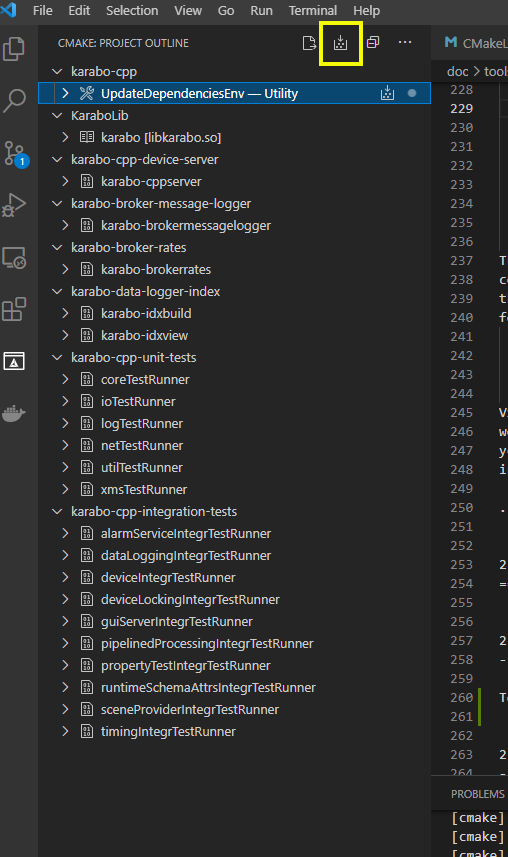
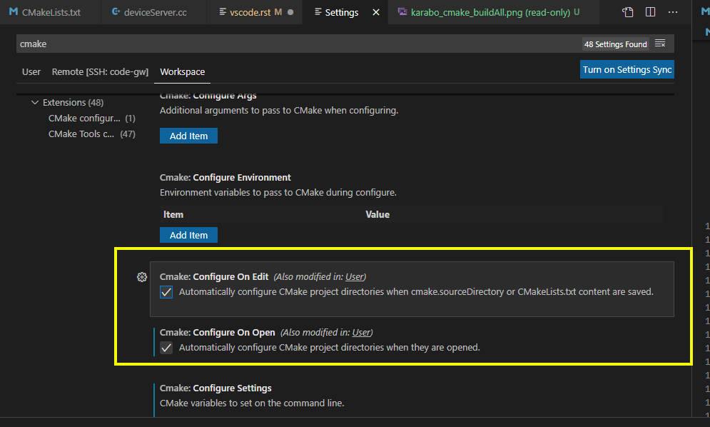

..
  Copyright (C) European XFEL GmbH Schenefeld. All rights reserved.

.. _toolsVscode:

************************
Getting Started - VSCode
************************

This guide provides instructions on how to setup VSCode for C++
development work on the Karabo Framework or on a Karabo C++ Device. The setup
instructions in here are for Ubuntu versions 18 and 20 - they should work
with few modifications for other Linux distributions supported by Karabo.

1. Installation Steps
=====================

1.1. Install VSCode
-------------------

To install VSCode, please follow the instructions at https://code.visualstudio.com/docs/setup/linux.

For Ubuntu, both the `snap` and the `apt` based installation methods work.

1.2. Install VSCode C/C++ Extensions
------------------------------------

Open VSCode, and install the following extension pack:

* C/C++ Extension Pack - https://marketplace.visualstudio.com/items?itemName=ms-vscode.cpptools-extension-pack

1.3. Configure GDB Pretty printing
----------------------------------

*This step may not be needed on your system*. Please test your VSCode with a simple
C++ program that has a `std::string`, a `std::vector` or any other standard container
and see if instances of those types are properly presented in the debug view.
In particular, on a Ubuntu 20 test system no extra
configuration was needed to have `gdb` pretty-printing working.

Without pretty-printing, some C++ Standard Library like `std::string` and `std::vector`
are not printed properly in the debugging view of VSCode (the string and vector highlighted by
the yellow rectangles in the image below):

To enable `gdb` pretty-printing, please create the file `~/.gdbinit` with the
following contents:

.. code-block:: python

   python
   import sys
   sys.path.insert(0, '/usr/share/gcc-[YOUR_GCC_MAJOR_VERSION]/python')
   from libstdcxx.v[YOUR_STDLIBCPP_MAJOR_VERSION].printers import register_libstdcxx_printers
   register_libstdcxx_printers (None)
   end

Replace [YOUR_GCC_MAJOR_VERSION] with the major version number of your `gcc`
installation, e.g. `7`,  and [YOUR_STDLIBCPP_MAJOR_VERSION] with the major
version number of you `stdlibc++` library, e.g. `6`.

For reference, this is an example of a working `~/.gdbinit` for Ubuntu 20 with
gcc 9.3.0 and gdb 9.2 installed:

.. code-block:: python

   python
   import sys
   sys.path.insert(0, '/usr/share/gcc-10/python')
   from libstdcxx.v6.printers import register_libstdcxx_printers
   register_libstdcxx_printers (None)
   end

Once `gdb` pretty-printing is configured, you should see `std::string` and other
C++ Standard Library types properly displayed in the VSCode debugging view (the
string and vector highlighted by the yellow rectangles in the image below).

1.4. Clone the Karabo Framework repository
------------------------------------------

Clone the Karabo Framework git repository into your local system with::

   git clone ssh://git@git.xfel.eu:10022/Karabo/Framework.git

or with::

   git clone https://git.xfel.eu/Karabo/Framework.git

depending on the access mode you have configured for the remote
Karabo git repository.

1.5. Configure the VSCode for the Karabo Framework Workspace
------------------------------------------------------------

To setup VSCode with the appropriate CMake related options for building the
Karabo Framework, go to the directory where you cloned the Karabo Framework in 
the previous step and from there run the script `build/karabo/setupVSCodeCMake.py`.
The script will create (or update) the file `.vscode/settings.json` used by 
VSCode as the settings for the workspace for the Karabo Framework project. 
The script is pretty safe: it backs-up any existing version of the `settings.json` 
file and it only sets the entries related to CMake. An example of the settings
updated (or added) by the script is given::

    "cmake.sourceDirectory": "/home/bob/work/Framework/src",
    "cmake.buildDirectory": "/home/bob/work/Framework/build_debug",
    "cmake.cmakePath": "/home/bob/work/Framework/extern/Ubuntu-20-x86_64/bin/cmake",
    "cmake.configureSettings": {
        "CMAKE_BUILD_TYPE": "Debug",
        "CMAKE_INSTALL_PREFIX": "/home/bob/work/Framework/package/Debug/Ubuntu/20/x86_64/karabo",
        "CMAKE_PREFIX_PATH": "/home/bob/work/Framework/extern/Ubuntu-20-x86_64",
        "BUILD_UNIT_TESTING": "1",
        "BUILD_INTEGRATION_TESTING": "0",
        "BUILD_LONG_RUN_TESTING": "0",
        "GEN_CODE_COVERAGE": "0"
    }

The `cmake.sourceDirectory` informs the VSCode CMake extension about the location of the 
root `CMakeLists.txt` file. If this parameter is not specified, VSCode will complain about 
not finding a `CMakeLists.txt` file in the root of the workspace and will prompt you to manually
choose the main `CMakeLists.txt` among all the `CMakeLists.txt` files it finds in the workspace.

As the Gitlab CI of the Karabo Framework project checks the formatting of the C++
source files for compliance with a standard style, it is recommended to also setup 
the options related to automatic formatting by VSCode. The standard style checked against 
is defined by the configurations in the `.clang-format` file at the root of the Karabo Framework
repository. A recommended configuration is shown by the excerpt of the `.vscode/settings.json` file shown below:: 

      "editor.defaultFormatter": null,
      "editor.formatOnPaste": true,
      "editor.formatOnSave": true,
      "editor.formatOnSaveMode": "file",
      "C_Cpp.formatting": "clangFormat",

The VSCode C++ Extension installed in step 1.2 contains a recent version of the `clang-format` tool,
so no installation is needed. If for some reason you prefer to use another instance of the 
`clang-format` tool, please be informed that the Gitlab CI uses version `13.0` of `clang-format`.
Formatting with any version older than that may result in the CI formatting test not passing.

Before opening the Karabo Framework CMake project inside VSCode, the `auto_build_all.sh` script must have
been executed successfully at least once with either the `Debug`, `Release` or `CodeCoverage` options.
`auto_build_all.sh` will take care of either downloading or building the external dependencies of the 
Karabo Framework and make them available to the CMake project. 

Similarly, as `auto_build_all.sh Clean-All` clears all the external dependencies, after its execution an
`auto_build_all.sh` with either the `Debug`, `Release` or `CodeCoverage` options must be completed successfully
before the CMake project can be opened and work properly again in VSCode.

Now open the local Karabo Framework repository working folder in VSCode by issuing the
following commands::

   cd [KARABO_FRAMEWORK_DIR]
   code .

VSCode should find the `CMakeLists.txt` file in the `src` folder of the Karabo Framework
working folder and ask you if you want to configure the CMake project. Just say
yes. Once the CMake project has been configured, you should see the following contents
in the CMake Project Outline view of VSCode:

2. Using your VSCode Environment
================================

2.1. Build the Karabo Framework
-------------------------------

To build the whole Karabo C++ Framework, please select the `Build All Projects`
in the CMake Project Outline view (highlighted in yellow in the image below).

If your CMake Project Outline view happens to empty, press the
`Configure All Projects` button that is to the left of the `Build All Projects`
button, in the same toolbar. That should execute the configure and generate
phases of the Karabo's Framework CMake project, and populate the previously
empty view.

If you don't want to press `Configure All Projects` in order to
have the CMake project outline updated, please open your Workspace preferences
and check that the `Cmake: Configure on Edit` and `Cmake: Configure on Open`
options are enabled (highlighted in yellow in the image below):

2.2. Run and Debug the Framework Tests
--------------------------------------

To run one of the Framework unit or integration tests, right-click on its
project node in the CMake Project Outline view - one of the `*Runner` nodes under
`karabo-cpp-unit-tests` or `karabo-cpp-intergration-tests` in the first image of
section 2.1. The context menu will have options to `Build`, `Debug`, and `Run`
the corresponding test.

If you prefer to run more than one test at once, please open a terminal, either
internal or external to VSCode, go to your build directory and issue a `ctest`
command. In the example below, all tests are run in the default non verbose
mode::

   cd ../../build_debug_karaboCpp
   ctest

It is also possible to run all tests whose names match a given regular expression
in either verbose mode (`-V` option) or extra verbose mode (`-VV`). In the example
below, `dataLoggingIntegrTestRunner` is the only test run, and in extra verbose
mode::

   ctest -VV -R "dataLogging*"

Verbose and extra verbose modes cause `ctest` to output, among other things,
one line per successful test case execution. The default verbosity
level only emits intermediate reports for failed test cases - the number of
successful test cases executed, without their names, is reported at the end
of the test execution while in default verbosity level.

To list all the tests that are available for `ctest` to execute::

   ctest -N

`ctest` also supports a `-E` option which is the complement of the `-R` option,
meaning execute all tests that do not match the given regular expression.

Some tests, especially some of the integration tests, require a `KARABO`
environment properly set. As the CMake build tree is not a full-blown Karabo
installation, you will need to `source` the `activateKarabo.sh` script before
running your test. That script is generated by the CMake build and is tailored
to your build tree. There are two ways of establishing a proper `KARABO`
environment in order to run tests and utilities, e.g. `karabo-brokermessagelogger`,
from the build tree:

* Launch VSCode from a shell where `source [BULD_TREE_PATH]/activateKarabo.sh`
  has already been executed, or,

* From the internal VSCode terminal session, execute the command
  `source [BUILD_TREE_PATH]/activateKarabo.sh`. Please be sure that you're
  issuing the command from the right internal terminal session - the one with
  `CMake/Launch` title in the terminal toolbar (picture below).

  .. image:: img/source_activateKarabo.png
