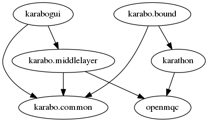
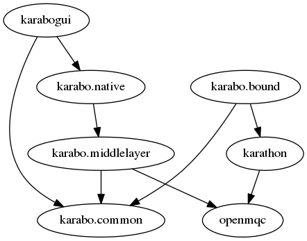
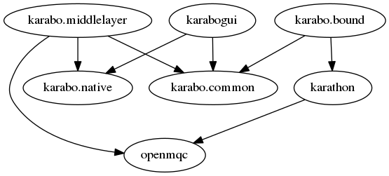

=============
Conda Roadmap
=============

Explanation
===========

This document represents a TODO list as well as a roadmap to define
the actions to be taken to achieve these milestones:

- Restructuring the Python API (unlocks releasing the data serialization
  code to xfel users and external groups)
- Packaging the karabogui in Conda (unlocks the GUI development to long
  living dependency testing, currently blocked from our depedency system)
- Refactoring the dependency system to conda (smaller repository,
  including only XFEL code, could be released bar conflicting licenses).
  (not yet split in sub tasks)

The order of the milestones has been chosen to provide the easiest way to
refactor the code while maintaining functionality.

TODO
====

The work has been split in as many MRs as possible to facilitate the review
and allow the developers to familiarize with the new technology.

Each task group should be revisited upon achievement of the previous milestone.

The dependencies look like this:

.. graphviz:: dot/api_now.dot

[X] Roadmap in git

[X] create ``karabo.native`` listing all the imports needed by ``karabogui``
from ``karabo``.

[X] API redirection for the GUI. from ``karabo.middelayer`` to
``karabo.native``

[X] Create an import tests that make sure that ``karabogui`` does not import
from ``karabo.middlelayer`` directly

After these steps, the dependencies look like this

.. graphviz::  dot/api_1.dot

**Achievement**: The GUI work is unimpeded by the restructuring.

[X] Refactor the project manager as a middlelayer device.

[] Move code from `karabo.middelayer_api` to `karabo.native`
and change the imports

[] Move code from `middelayer_api` to `karabo.project` and change
the imports

.. graphviz:: dot/api_goal.dot

**Milestone reached**: API separation

[] conda recipe and build system for ``karabo-native``. 

[] conda recipe and build system for ``karabogui``

**Milestone reached**: GUI can be installed by conda!

[] Document how to upgrade dependencies in conda

[] Remove all GUI dependencies from the ``extern`` folder

**Achievement**: GUI plotting and QT5 is enabled

Upwards and onwards!

The task below **must** be revisited at milestone achiements

[] conda recipe for ``pythonKarabo``

[] conda recipe for ``karabo`` (the C++ code)

[] world domination?